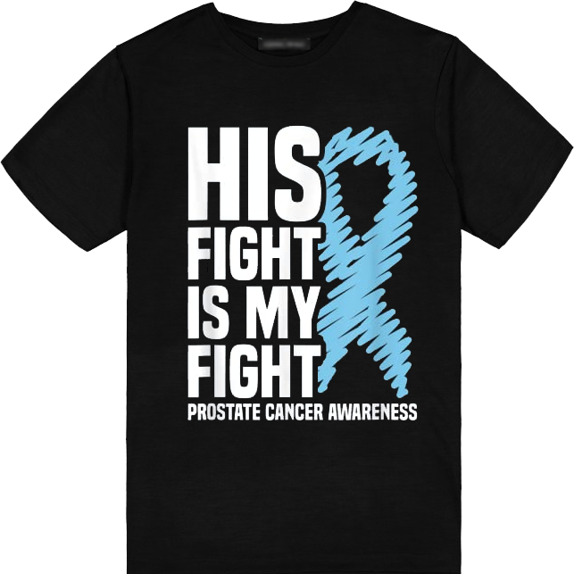
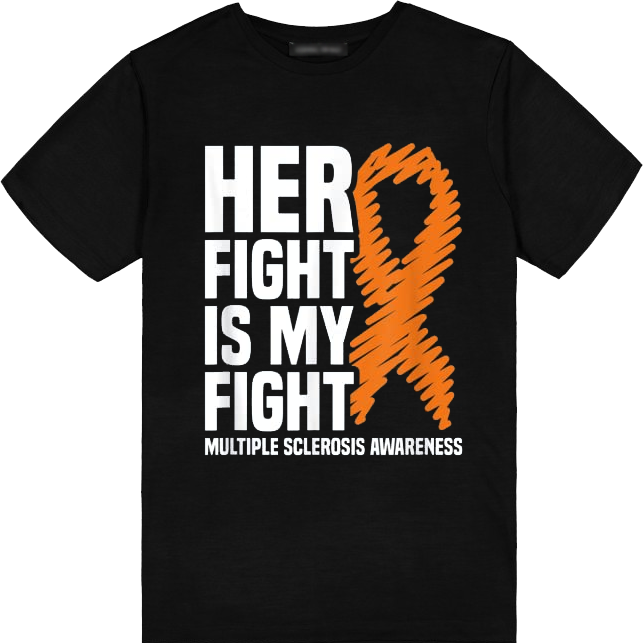

***"We have complete control over our own attitude. We are the ones who decide how we feel, how we look at things, how we react."*** *- Catherine Pulsifer*

What a surprise when I arrived for my first day of treatment. Cheryl and I had a whole routine we were going to improv and film to kick off the **&lt;360 Awareness Project** and my impression of a microwaveable popcorn bag.  As you may have seen in our Day 1 video, we showed up only to find that the radiation plan was yet again going through another rewrite.

Late last week, when reviewing scans and records, my oncologist determined that some additional hot spots for Cancer were detected in a couple more lymph nodes.  While I admit, this "setback" was disappointing, I guess the alternative (being dead sooner) is not as appealing as waiting a few days.  However, we are not waiting to push forward on the **&lt;360 Awareness Project**.

We felt this first day was a perfect opportunity to highlight that when it comes to medicine, change is always present, flexibility is must, and nothing is guaranteed.  We live our lives chasing schedules and goals that we often times forget to stop and "smell the roses". We forget to stop and appreciate this thing called life.  Remember, change will happen whether you want it to or not, however it's how you choose to deal with change that will make it seem tolerable or not.

Without change, I would not be alive in a year.  Had this diagnosis befallen me 50 years ago, I most certainly would be celebrating the last of each of the holidays 2023 would bring. 2024 likely would be a future I would not see.  Despite the change of starting treatment a mere 5 days later than planned, seems a small inconvenience to give myself... to give Cheryl and I, the best longevity together possible.

{{#figure-container}}

{{^}}
When they radiate me I told them all I want are the protons, keep the electrons, because all I want are positive things in my life.

Check out our video for Day 1 <a href="https://www.facebook.com/brianscoutmasterbucky.reiners/videos/593701476121629">here</a>.

Today's T-Shirt that Cheryl wore available <a href="https://www.amazon.com/gp/product/B08FRFQ8ZV/ref=ppx_od_dt_b_asin_title_s01?ie=UTF8&customId=B07537PKB3&psc=1">here</a>.
{{/figure-container}}
{{#figure-container}}

{{^}}

Today's T-Shirt that I wore available <a href="https://www.amazon.com/gp/product/B08HJXHYS1/ref=ppx_od_dt_b_asin_title_s01?ie=UTF8&customId=B07537PKB3&psc=1">here</a>.

Radiate Positivity and Embrace the Adventure of Change.

{{/figure-container}}

