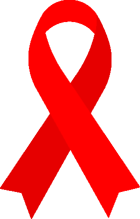

In the early 1970s, the song "Tie a Yellow Ribbon Round the Ole Oak Tree" was released, and based on this song, Penney Laingen, wife of Iran hostage Bruce Laingen, was the first who used the ribbon as an awareness symbol. Awareness ribbons started as single color ribbons, but as their popularity caught on they hav eveloved to be two-color or even tri-color ribbons.  While this is a detailed list it is by far not as comprehensive as some sources.  Without an official registry there is a lot of ambiguity among sources as well.

{{#figure-container}}

{{^}}
**BLACK**  Accidents, Anti-Terrorism, Funerals, Gang Prevention, Insomnia, Melanoma, Mourning, Narcolepsy, POW/MIA, Skin Cancer, Sleep Apnea
{{/figure-container}}

{{#figure-container}}

{{^}}
**BROWN**  Anti-Tobacco, Tobacco Awareness
{{/figure-container}}

{{#figure-container}}

{{^}}
**BURGUNDY**  Adults with Disabilities, Arteriovenous Malformation (AVM), Brain Aneurysm, Cesarean Section,  Factor V Leiden, Headaches, Hospice Care, Meningitis, Migraine, Multiple Myeloma, and Sickle Cell Anemia
{{/figure-container}}

{{#figure-container}}

{{^}}
**CRANBERRY**  Fibromyalgia
{{/figure-container}}

{{#figure-container}}

{{^}}
**RED**  Blood Cancers, Diseases, and Disorders, Burn Victims, Cardiovascular Disease, Courage and Inspiration, DARE, Disaster Relief, Distracted Driving, Driving under the Influence, Drug Addiction, Evans Syndrome, High Blood Pressure, HIV/AIDS, Huffing / Sniffing Abuse, Hypertension, Inhalant Abuse, Love, Mothers Against Drunk Driving (MADD), Stroke, Substance Abuse, Tuberculosis, Women’s Heart Health
{{/figure-container}}

{{#figure-container}}

{{^}}
**HOT PINK**  Cleft Palate
{{/figure-container}}

{{#figure-container}}

{{^}}
**PINK**  Birth Parents, Breast Cancer, Nursing Mothers, Women’s Health
{{/figure-container}}

{{#figure-container}}

{{^}}
**PEACH**  Endometrial Cancer, Vaginal Cancer, Uterine Cancer
{{/figure-container}}

{{#figure-container}}

{{^}}
**ORANGE**  ADHD, Chronic Obstructive Pulmonary Disease (COPD), Cultural Diversity, Kidney Cancer, Leukemia,  Malnutrition / Hunger, Multiple Sclerosis (MS), Self-Injury / Self-Harm, Spinal Cancer, Work Zone Safety
{{/figure-container}}

{{#figure-container}}

{{^}}
**AMBER**  Appendix Cancer
{{/figure-container}}

{{#figure-container}}

{{^}}
**GOLD**  Childhood Cancer
{{/figure-container}}

{{#figure-container}}

{{^}}
**YELLOW**  Adoptive Parents, Bone Cancer, Carbon Monoxide Poisoning, Endometriosis,  Liver Cancer / Disease, Missing Persons, Obesity, POW/MIA, Suicide Awareness and Prevention,  Support our Troops
{{/figure-container}}

{{#figure-container}}

{{^}}
**LIGHT GREEN**  Celiac Disease, Chronic Pelvic Pain, Human Papilloma Virus (HPV), Sexually Transmitted Diseases (STD)
{{/figure-container}}

{{#figure-container}}

{{^}}
**LIME GREEN**  Lyme Disease, Mental Health and Illnesses, Muscular Dystrophy, Non-Hodgkin’s Lymphoma (Lymph Node Cancer), Psychosis, Spinal Cord Disorders
{{/figure-container}}

{{#figure-container}}

{{^}}
**GREEN**  Bipolar Disorder, Bone Marrow Disease, Cerebral Palsy, Depression, Cirrhosis of the Liver, Eye Injury and Cancer, Gallbladder Cancer, Glaucoma, Kidney Donation, Mental Health and Mental Illness, Organ / Tissue Donation, Spinal Cord Injury and Research, Stem Cell Donation and Research
{{/figure-container}}

{{#figure-container}}

{{^}}
**JADE**  Hepatitis B, Liver Cancer
{{/figure-container}}

{{#figure-container}}

{{^}}
**SEA FOAM**  Lisping, Stammering, Stuttering
{{/figure-container}}

{{#figure-container}}

{{^}}
**TEAL**  Addiction Recovery, Anxiety Disorders, Food Allergies, Compulsive Disorder,  Gambling Addiction, Hoarding, Ovarian Cancers, Panic Disorder,  Post Traumatic Stress Disorder (PTSD), Rape, Sexual Assault/Abuse/Violence, Social Anxiety, Stress Disorders, Tsunami Victims
{{/figure-container}}

{{#figure-container}}

{{^}}
**TURQUOISE**  Addiction Recovery, Bone Tumor Awareness, and Interstitial Cystitis, Tourette’s Syndrome
{{/figure-container}}

{{#figure-container}}

{{^}}
**ROBIN EGG**  Pierre Robin Syndrome
{{/figure-container}}

{{#figure-container}}

{{^}}
**LIGHT BLUE**  Chronic Illness, Foster Care Awareness, Graves’ Disease, Men's Health, Prostate Cancer, Spay / Neuter Pets, Thyroid Disease
{{/figure-container}}

{{#figure-container}}

{{^}}
**PALE BLUE**  Achalasia Disease
{{/figure-container}}

{{#figure-container}}

{{^}}
**WHITE**  Adoption, Blindness, Bone Disease and Cancer, Child Sexual Abuse/Assault Awareness, End Violence Against Women, Hernia, Hope and Support, Invisible Illness, Lung Disease and Cancer, Online Sexual Predator Awareness and Internet Safety, Osteoporosis, Postpartum Depression, Scoliosis
{{/figure-container}}

{{#figure-container}}

{{^}}
**SILVER**  Brain Disabilities and Disorders, Disabled Children, Dyslexia, Elderly Abuse, Encephalitis, Parkinson’s Disease, Schizophrenia, Sciatic Pain
{{/figure-container}}

{{#figure-container}}

{{^}}
**PEARL**  Emphysema, Lung Disease and Cancer, Mesothelioma
{{/figure-container}}

{{#figure-container}}

{{^}}
**PERIWINKLE**  Acid Reflux, Anorexia Nervosa, Bulimia Nervosa, Eating Disorders, Esophageal Cancer, Gastric Cancer, Gastroesophageal Reflux Disease (GERD), Irritable Bowel Syndrome (IBS), Pulmonary Hypertension, Small Intestine Cancer, Stomach Cancer
{{/figure-container}}

{{#figure-container}}

{{^}}
**GRAY**  Allergies, Asthma, Brain Cancer, Brain Tumor Awareness, Borderline Personality Disorder, Mental Illness
{{/figure-container}}

{{#figure-container}}

{{^}}
**BLUE JEANS**  Hereditary and Genetic Diseases
{{/figure-container}}

{{#figure-container}}

{{^}}
**BLUE**  Acute Respiratory Distress Syndrome (ARDS), Anti-Bullying, Autism Awareness, Chronic Fatigue Syndrome, Dystonia, Huntington’s Disease, Hurricanes, Ichthyosis, Malaria, Parkinson’s Disease, Police Lost in Line of Duty, Restless Legs Syndrome, Rheumatism, Teens against Smoking, Transverse Myelitis, Victim’s Rights, Water Accidents, Water Quality, Water Safety, West Nile Virus
{{/figure-container}}

{{#figure-container}}

{{^}}
**ROYAL BLUE**  Child Abuse Awareness, Spinal Neurological Conditions
{{/figure-container}}

{{#figure-container}}

{{^}}
**NAVY BLUE**  Arthritis, Colon Cancer, Colorectal Cancer, Rectal Cancer
{{/figure-container}}

{{#figure-container}}

{{^}}
**PURPLE**  ADD, Alzheimer’s Awareness, Chronic Pain, Crohn’s Disease, Cystic Fibrosis, Dementia, Domestic Violence, Drug Overdose, Homelessness, Lupus, Macular Degeneration, Military Kids, Opioid Crisis, Pancreatic Cancer, Pancreatitis (Chronic), Religious Tolerance, Rett Syndrome, Seizure Disorders, Thyroid Cancer
{{/figure-container}}

{{#figure-container}}

{{^}}
**VIOLET**  Hodgkin’s Disease and Hodgkin’s Lymphoma
{{/figure-container}}

{{#figure-container}}

{{^}}
**ORCHID**  Testicular Cancer
{{/figure-container}}

{{#figure-container}}

{{^}}
**LAVENDER**  Caregiver Appreciation, Epilepsy, Foster Care, General Cancer Awareness
{{/figure-container}}

{{#figure-container}}

{{^}}
**BLUE & BLACK**  loss of a male child, mourning a brother, loss of a brother, mourning a son
{{/figure-container}}

{{#figure-container}}

{{^}}
**BLUE & GRAY**  Diabetes
{{/figure-container}}

{{#figure-container}}

{{^}}
**BLUE & PINK**  Birth Defects, Child Loss, Infant Diseases, Infertility, Male Breast Cancer, Miscarriage, Prematurity, Prostate & Breast Cancer Together, Stillbirth, Sudden Infant Death Syndrome (SIDS)
{{/figure-container}}

{{#figure-container}}

{{^}}
**BLUE & WHITE**  Teen Cancer
{{/figure-container}}

{{#figure-container}}

{{^}}
**ORANGE & LAVENDER**  Eczema and Psoriasis
{{/figure-container}}

{{#figure-container}}

{{^}}
**ORANGE & WHITE**  Bicycle Safety and Bicycle Helmet Safety
{{/figure-container}}

{{#figure-container}}

{{^}}
**PINK & BLACK**  loss of a female child, mourning a sister, loss of a sister, mourning a daughter
{{/figure-container}}

{{#figure-container}}

{{^}}
**RED & BLUE**  Heart Ailments, Defects, Diseases, and Syndromes
{{/figure-container}}

{{#figure-container}}

{{^}}
**RED, WHITE, & BLUE**  Military and Troop Support and Patriotism
{{/figure-container}}

{{#figure-container}}

{{^}}
**SILVER & GOLD**  Deafness, Hearing Diseases, Impairments, and Loss
{{/figure-container}}

{{#figure-container}}

{{^}}
**TEAL & PURPLE**  Domestic Violence, Sexual Assault, Suicide, Surviving Family Members of Suicide
{{/figure-container}}

{{#figure-container}}

{{^}}
**TEAL & WHITE**  Cervical Cancer
{{/figure-container}}

{{#figure-container}}

{{^}}
**YELLOW & BLUE**  Down Syndrome and Designated Drivers
{{/figure-container}}

{{#figure-container}}

{{^}}
**YELLOW & PURPLE**  Bladder Cancer
{{/figure-container}}

{{#figure-container}}

{{^}}
**PUZZLE**  Autism and Asperger’s Syndrome
{{/figure-container}}

