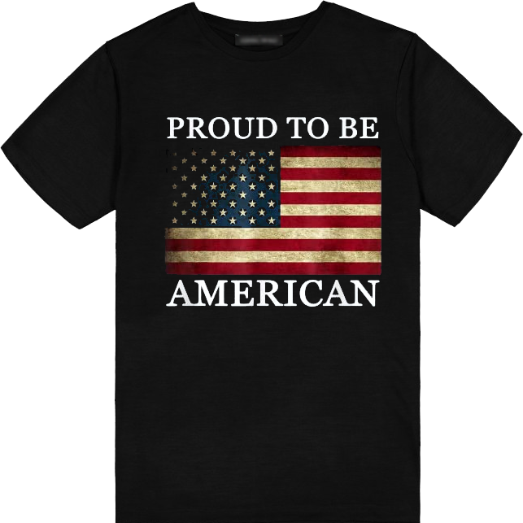

***"'America has many good things to give you and your children after you. But, these good things depend on the qualities she instills in her citizens. As an Eagle Scout, you are prepared to help America in all that she needs most. She has a great past, and you are here to make her future even greater.'"*** *taken from the Boy Scouts of America Eagle Challenge*

Add text here

{{#figure-container}}

{{^}}

Thank a Veteran for the freedoms you have been provided.

Today's T-Shirt available Today's T-shirt available <a href="https://www.amazon.com/gp/product/B00Y5X50HQ/ref=ppx_od_dt_b_asin_title_s00?ie=UTF8&th=1&psc=1">here</a>.

Check out the Day 6 video Today's T-shirt available <a href="https://www.facebook.com/brianscoutmasterbucky.reiners/videos/216443877657306">here</a>.
{{#figure-container}}
