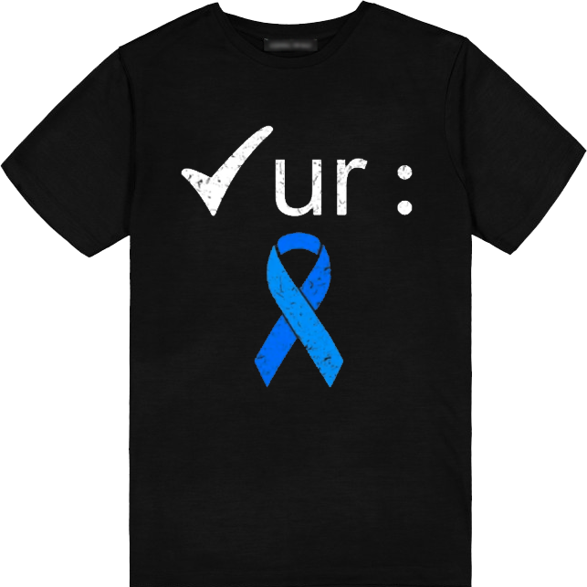

Today my 80 year old mother joined me, but was less than enthusiastic to appear on video, let alone a picture that would be posted to the internet.  I respectfully honor my mom's wishes and have not created a video or picture with her in it today.  However, something near and dear to both of our hearts is the awareness topic today; the cancer that ultimately took my father's life.  Colon Cancer.

While my father was diagnosed in the very early stages of Prostate Cancer, years later it was discovered that he had advanced stage 4 Colon Cancer.  Two years later he passed after 2 rounds of chemotherapy to try and beat the odds.

Colon and Rectal Cancers share many similar characteristics and really vary mostly in where they originate. They are some of the easiest to address and even easier to identify with all the preventitive measures of testing available today.  Everyone has heard of the most reliable; the colonoscopy.  What used to be a recommended age 50 introduction to the colonoscopy experience has now been dropped to 45. This is not a hard number as anyone younger is encouraged to be checked, especially if there is any family history of colon or rectal cancers.

I am a bit of a hypocrite, I waited until I was 56 years old to have my first colonoscopy and I GOT LUCKY.  While they found some polyps, none were found to be problematic or cancerous.  I admit it was all very macho and manly excuses to procrastinate. But hey, not only was I probed but they not only identify all polyps, but they remove and test them as well as a part of your colonoscopy.  Because of my age and family history, I will likely need to maintain an annual check for the next few years, but as you aged (and without any concering issues) these intervals of needing follow up colonoscopies can grow to 5 years or even 10 years.  So really, how simple to save a life, especially your own.

Colon and Rectal Cancers are some of the easiest to treat with early detection.  Don't be foolish like myself and put it off, I even recommend skipping the "shortcut" or "easier" testing methods and do the most reliable and accurate method; the full on colonoscopy.  Don't put it off another day - Schedule your Colonoscopy today. Kick Colon / Rectal Cancer in the Butt.

Enjoy our video from today (Day 8), you should get a laugh from it thanks to the CDC - <a href="https://www.facebook.com/brianscoutmasterbucky.reiners/videos/587653896644252">see the video here</a>.

{{#figure-container}}

{{^}}

Although you can't see my T-Shirt for today because I am not in the video, here is the link to the one you would have seen.

Today's T-Shirt available <a href="https://www.teepublic.com/t-shirt/20292792-check-your-colon-cancer-awareness-costume-survivor?feed_sku=20292792D1V&feed_country=US&utm_source=google&utm_medium=shopping&utm_campaign=%5BG%5D+%5BG.NAM%5D+%5BL.ENG%5D+%5BGEN%5D+%5BC.TShirts%5D+%5BPLF%5D&utm_id=notset&utm_content=cancer+awareness&ar_clx=yes&ar_channel=google&ar_campaign=71700000088748521&ar_adgroup=58700007503484722&ar_ad=PRODUCT_GROUP&ar_strategy=search&utm_source=google&utm_medium=cpc&utm_campaign=%5BG%5D+%5BG.USA%5D+%5BL.ENG%5D+%5BGEN%5D+%5BC.TShirts%5D+%5BSSC%5D&gclid=Cj0KCQjwuLShBhC_ARIsAFod4fJeqr4mXC9EUBVgZgV4eyqis4YQ51Zsa9TCcfdNJlQmECWnamy6h28aAp-uEALw_wcB&gclsrc=aw.ds">here</a>.

{{/figure-container}}

