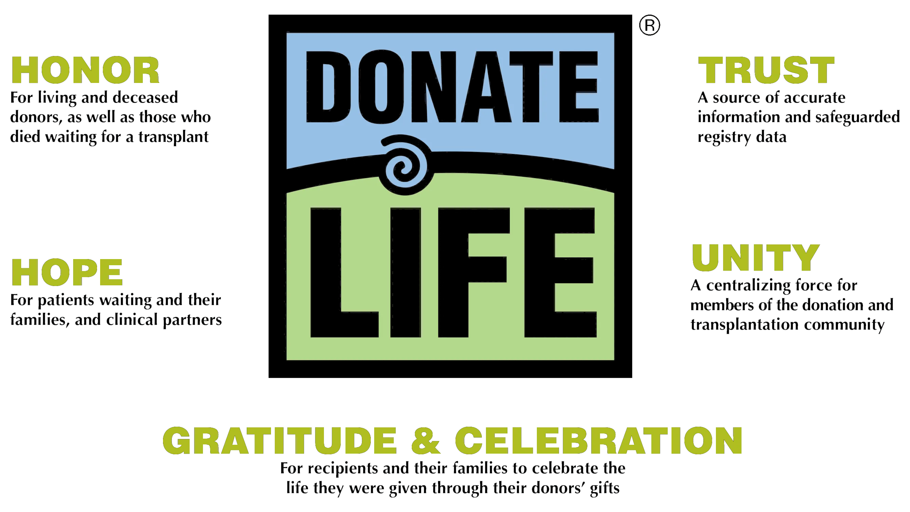

National Donate Life Month (NDLM) was established by Donate Life America and its partnering organizations in 2003. Observed in April each year, National Donate Life Month helps raise awareness about donation, encouraging Americans to register as organ, eye and tissue donors and to honor those that have saved lives through the gift of donation. For 2023 National Donate Life Month (NDLM) theme was inspired by the natural world of a pond coming to life in the spring.

Frogs (and toads!) are a sign of healing and renewal, and water lilies represent hope. The lily pads we see on the surface of a pond are part of a much larger plant rooted below the water. The water lily plant reminds us of the support and collaboration needed for hope to bloom.

This National Donate Life Month, we ask you to be a part of this interconnected life-sustaining community by registering as an organ, eye and tissue donor; becoming educated about living donation; and championing the Donate Life cause.

Find out more at https://donatelife.net/

#360Bucky

