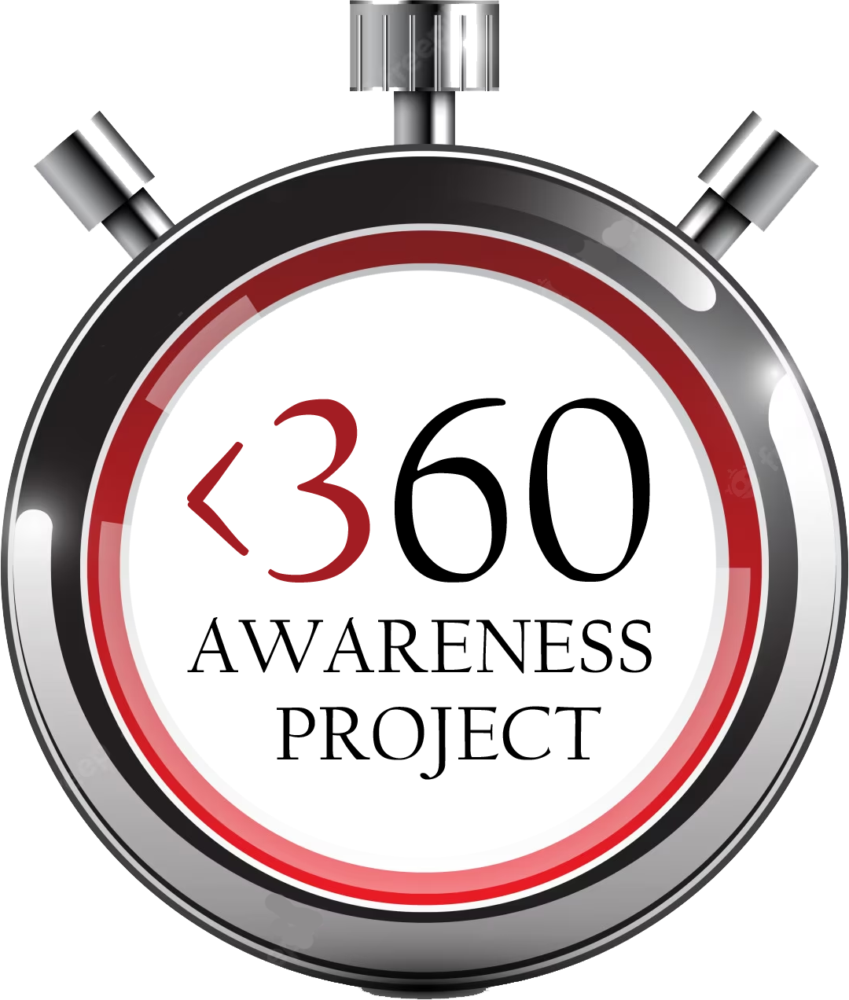

## 2023 &lt;360 Awareness Project

{{#figure-container position="top"}}

{{^}}

In November 2022, shortly after Thanksgiving, I (Scoutmaster Bucky) was initially diagnosed with Stage 4 Prostate Cancer.  Over these initial 4 months, navigating the unknown, discovering good and bad, grasping mortality and faith, traversing the highs and lows, and redefining life ambitions and goals, I present the **&lt;360 Awareness Project**.

This initiative is to get people talking... to help bring awareness to causes, issues, and organizations; to help broaden your own self and social awareness.

60 days, 60 topics, 60 seconds.

***&lt;360 Awareness Project***

***#360Bucky***
{{/figure-container}}

{{#ancestryReverse.childrenByName.2023.ancestryReverse.members}}
{{>360-tile event=. year=2023}}
{{/ancestryReverse.childrenByName.2023.ancestryReverse.members}}

