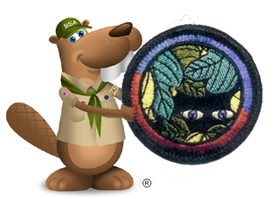
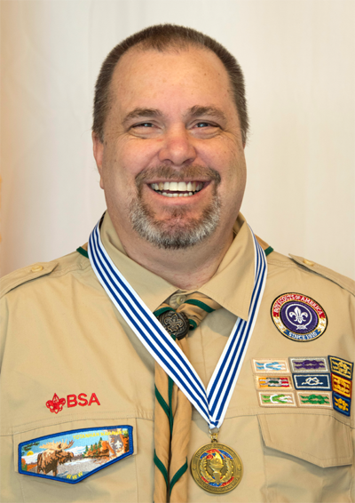

## About The Scoutmaster Bucky Program

***First and foremost, the Scoutmaster Bucky program started, grew, and exists because of the dedication, commitment, and support to our youth that so many fellow volunteers have given, and continue to give, to Scouting and the Scoutmaster Bucky Program. THANK YOU VERY MUCH each and every one of you.***

The Scoutmaster Bucky Program started in January 2009, by accident. As a monthly Saturday morning merit badge get-together for the handful of Scouts that formed Scoutmaster Bucky's first troop. These opportunities were also made available to neighboring troops in the spirit of Scouting to join in. Interest and popularity spread quickly, and growth doubled each month; 12 Scouts that first January growing to nearly 200 Scouts attending the monthly event in May of that year.
{{#figure-container position="top"}}

{{^}}
In 2012, the Scoutmaster Bucky program was asked to pilot a potential new merit badge for the Boy Scouts of America on Invasive Species.  100 local Scouts participated and had positive feedback, but due to changes at the time at the National level, this merit badge never came to be.

In 2013 the Scoutmaster Bucky program introduced the **Honor Weekend** program; a weekend-long program for teenagers focusing on manners, etiquette, and social graces which ran until 2020. Also in 2013, the **Scoutmaster Bucky Online** program was one of the first to offer online merit badge opportunities. Some in the online community loudly proclaimed unwarranted criticism of these online offerings, at least until 2020. Everything changed as the COVID-19 pandemic ascended upon our Scouting world and attitudes seemed to change almost overnight.

The Scoutmaster Bucky Online Program in 2020 gained tremendous awareness and a following beyond anyone's imagination. Today Scouts from nearly every state in our country, and from around the world, have participated in the Scoutmaster Bucky Online program.

**ScoutmasterBucky.com** strives to provide the most accurate and current version of requirements and insight in Scouting in the areas of STEM, Merit Badges, and more. With new content always being developed and added, the website is a platform for innovation and evolution for Today's Scouting youth and their families. As such, the Scoutmaster Bucky website is one of the most visited Scouting websites online today.

Today, the Scoutmaster Bucky Program, like so many other things, is slowly regrouping from the tragic aftermath of the COVID 19 pandemic.  We have seen slow but continual growth again and are excited to be evolving, innovating, and providing opportunities for our Scouting youth, and beyond, to help them "Be Prepared!"
{{/figure-container}}

## The Scoutmaster Bucky Team

### Scoutmaster Bucky (Brian Reiners)

{{#figure-container position="top"}}

{{^}}
Scoutmaster Bucky, also known as Brian Reiners, started serving youth in the Boy Scouts of America in 2005 shortly after he and his wife accepted the fact that they medically would not be able to have children of their own. While serving in the United States Air Force, Brian's natural ability to work with and mentor youth was evidenced by his service to youth through coaching Little League Baseball for 6- and 7-year-olds, as well as working with teens and tweens in the area of theater, singing, and public speaking.  It was no surprise to his friends and family when he was asked to help with a local Pack that he not only agreed to serve as the Pack Committee Chair but took little convincing to take on the new Tiger Den Leader opportunity.

In 2007 Brian took on the role of Cubmaster, and just a year later was asked to serve as Scoutmaster for the newly formed associated Troop. For nearly 12 years he served as both Cubmaster and Scoutmaster, until two local packs merged and Pack and Troop 042 merged and became Pack and Troop 384. While Brian "retired" from the Cubmaster role, to this day he continues serving as Scoutmaster.  He CO-Scoutmasters with his female Scoutmaster counterpart, as the boys and girls of Troop 3384 and 5384 respectively, simply function and identify as Troop 384.

While his primary focus is at the unit level, for over a decade Brian has provided his skills, resources, and leadership to initiatives at the district, council, and national levels. These include top leadership in District Camporees, District Pinewood Derbies, District Merit Badge Days, Wood Badge Staffing, OA Leadership Development, National Staff NOAC, Council Events like the Adult Volunteer Recognition Dinner and University of Scouting, as well as serving as the Advisor for a Venturing Unit for the 2017 National Jamboree.

Scoutmaster Bucky has been recognized with many awards and recognitions during his tenure in Scouting which includes, but is not limited to; the District Award of Merit, the Silver Beaver, the Bronze Pelican, the Adult Religious Emblem Award, the Venturing Leadership Award, the Order of the Arrow Vigil Honor, and most recently the Torch of Gold Award for "exceptional service and leadership working with Scouts who have disabilities". Most impressive are the nearly 50 Venturing and Scouts BSA mentor pins he has received from youth over the years.

Brian's skills in public speaking, training, and mentoring coupled with his energy, passion, and natural ability to connect with youth, make him a favorite counselor for the youth.
{{/figure-container}}

### Mrs. Scoutmaster Bucky (Cheryl Reiners)

Coming soon!

### Scoutmaster Jeff aka Earnest the Eagle (Jeff Jurek)

Coming soon!

### Mr Clever Coyote (Tyler Akins)

Coming soon!

### Magical Mary (Mary Wangerin)

Coming soon!

### Gracious Mary (Mary Woida)

Coming soon!

### Virtuous Vicki (Vicki Jurek)

Coming soon!

### Tony Vu Tiger (Tony Phan)

Coming soon!

### El Sal Dior (Sal Aloisio)

Coming soon!

### Advisor Bev (Bev Verweg)

Coming soon!
