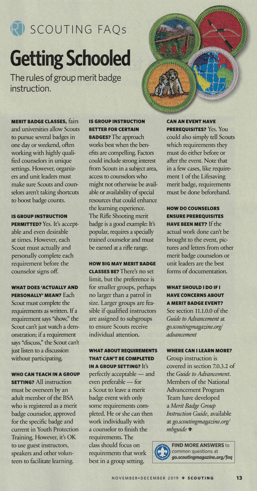

## Counselors at Bucky Events

Everyone involved in this program is a volunteer. The cost associated with the classes primarily go towards renting the facility. Other costs are also covered, such as covering the materials in class, various expenses related to running this program, and sometimes even a lunch for the counselors. This program would not exist without the countless hours that people are giving up every month in order to assist youth.

Merit badges sessions have registered adult leaders that are also merit badge counselors. These classes are always limited in size in order to ensure quality instruction, and that size depends on the merit badge and the counselor. We are constantly striving to improve the program and add additional classes, so please consider offering your knowledge so we can serve more youth. We can ensure smaller class sizes to help get you started. If you're only interested in teaching a single class, we can work with that as well.

There are occasions when a merit badge counselor can not show up for their class. Our backup plan is to have a person knowledgeable in the field perform the instruction and another registered merit badge counselor would be the signatory. Even in this situation, we still follow the rules for merit badges. Nobody is getting a "free ride" and the quality of the class will be upheld.

### Rules for Merit Badge Counselors

Scouting Magazine has guidance on [group merit badge instruction](group-merit-badge-instruction.jpg). We follow everything there, plus have several suggestions for a more successful experience in your class.

{{#figure-container position="top"}}

{{^}}
1. **Youth Protection at all times.** Of course we must always keep youth safe.
2. **We're here to serve youth.** The focus of the class needs to be on the audience and doing what we can to assist their growth.
3. **Scouts must meet the requirements.** Counselors may provide information, but it is the responsibility of the Scout to complete the requirements exactly as written. If the requirements says "show", then the Scout must show; a discussion doesn't count.
4. **Expect partials at the end.** Several requirements can only be done outside of a class. When Scouts show up and haven't done the necessary tasks, they can't get the merit badge yet. Allow follow-up after class (with a parent) and encourage completion of outstanding requirements at a later date.
5. **Participation is required.** Scouts that are not engaged in class are not earning the merit badge. It's good to let them know that their inaction and unattentive behavior is causing them to miss requirements.
6. **Trust, but verify.** We know Scouts are trustworthy, however we are required to also verify that work was done. Scouts need to bring proof of events, such as letters from parents, approvals from Scoutmasters, pictures, video, the completed work item, or viewing the Scout's record in Scoutbook.

In addition to those rules, we've learned a lot about how classes should be ran in order to make your life easier and keep Scouts engaged. Here's a few points to help.

1. **Add variety.** Several hours of lecture is boring. Add games, change locations, intermingle hands-on activities and keep the class's attention by making sure there are differences throughout the time.
2. **Do not tolerate disruptive behavior.** It is not fair to the other members in the class when there's misbehavior. A good policy is to warn once, then remove the disruptive Scout and have them visit Scoutmaster Bucky. He can often work with the youth to move forward in a positive manner.
3. **Projectors are boring.** A huge slide deck with lots of words per slide is a monotonous, non-interactive presentation. When projectors are used, ensure they display visual aids and talking points. Don't read from slides.
4. **Focus on the Scouts.** They are all here for a reason. Even if they only leave with partials, it would be best to ensure that the class time targets their merit badge needs and helping them as much as you can on their journey.

Sounds interesting? Please reach out to Scoutmaster Bucky at <a href="mailto:ScoutmasterBucky@yahoo.com?subject=Volunteer Merit Badge Counselor">ScoutmasterBucky@yahoo.com</a>.
{{/figure-container}}
