These instructions have been developed to help aid Scouts BSA Youth as well as Scouts BSA Merit Badge Counselors to properly manage and complete the Application For Merit Badge (“Blue Card”).

## What Is a Blue Card?

The Blue Card is a two-sided, tri-section document, which is formally known as The Application For Merit Badge.  It is an official Boy Scouts of America document that serves as a record of progress toward completion of a merit badge. You will need to know a few things about this important document if you plan on earning merit badges and becoming an Eagle Scout.

## On Your Mark, Get Set, Whoa!

So you want to earn a merit badge. Well the first thing you need is a Blue Card.  You can get these from your Scoutmaster or talk to your Patrol Leader or Senior Patrol Leader and they can direct you to where your Troop keeps their blue cards.  There is only one person who is responsible for your blue card, and that is you.

Some Troops have software that print out these “Blue Cards” and some units may still have old stock of these forms which use to be printed on yellow stock.  Any of these will do, however for this instruction set the Application For Merit Badge will be referred to as Blue Card.

You may want to keep a few extra blank blue cards in your Scouts BSA Handbook or Notebook to have available for yourself or too help out another Scout when needed.

## So now that I have my Blue Card, can I start on my Merit Badge?

    NO!
    

        

            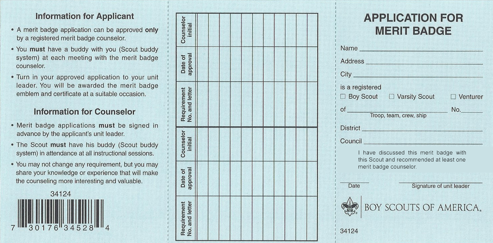
        

        

            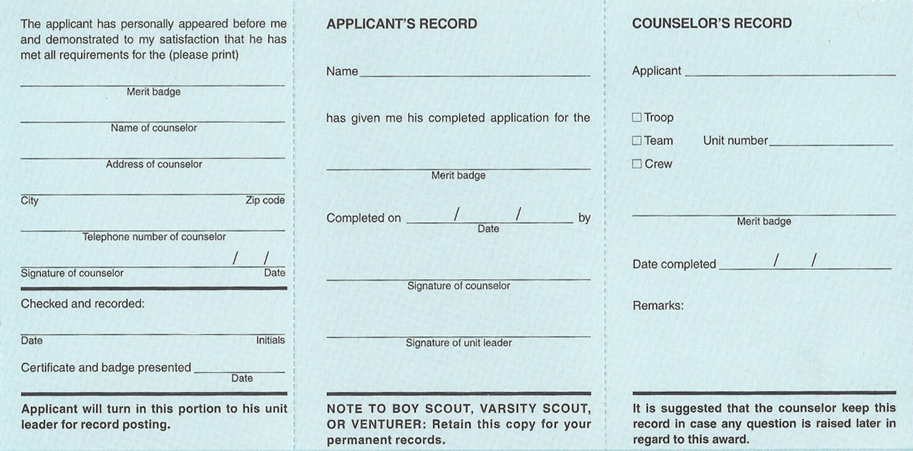
        

    

ollowing is a step-by-step guide to completing your Blue Card.  Everything you need to know and the steps to follow are outlined in detail on the following pages.  Reviewing these and utilizing these instructions will insure that your merit badge paperwork for completion is as accurate and correct as possible.

Please keep in mind, it is NOT acceptable for your Scoutmaster, your parent, or anyone besides yourself to fill out YOUR Blue Card.  You filling out the Blue Card is just as important as you performing the skills and demonstrating the knowledge in order to complete the requirements for the merit badge.  No one else can or should do this for you.

So now that you have your Blue Card, you need to fill it out.  Each side of the blue card is divided into three sections, left, center, and right.  These three sections should be kept together and not detached from each other until you are finished with the merit badge and instructed to detach a section. Let’s turn the blue card to what will be referred to as the “front” side and start with the right section of the form.

{{#figure-container align="right" position="top"}}
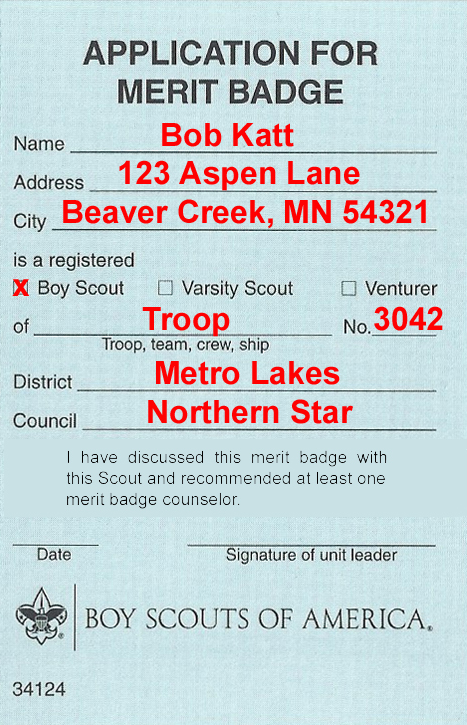
{{^}}

This section requires you to fill in a lot of information.

Start at the top with filling out your full legal name.  This means your given first name and last name.

Next you need to put in your street address followed on the next line with your city, state, and zip code.  You may have to write small, but trust me, if you write clearly and small enough, you can fit it all on the two lines.

Next make sure you check the appropriate box whether you are Scouts BSA Scout, or Varsity Scout, or Venturer.  The next line you need to fill in whether you are earning this as a member of a Troop, Team, Crew, or Ship, followed by your unit number.

The following two lines require you to fill in the District in which your unit is associated and the Council in which you belong.  If you don’t know your Council, just look at your shoulder patch on your left shoulder for a hint.

There is a sample of what this section should look like when you are finished with this step. We will come back to this side of the Blue Card and this section later.

{{/figure-container}}

Turn the blue card over and let’s see what needs to be filled out on this side; the “back side”.

Scoutmaster Bucky likes to use the 1-2-3 Method when filling out this side of the Blue Card. Starting from left to right you need to initially fill in 1 item in the left section, 2 items in the center section, and 3 items in the right section. With the 1-2-3 Method, it’s easy as 1-2-3.

{{#figure-container align="right" position="top"}}
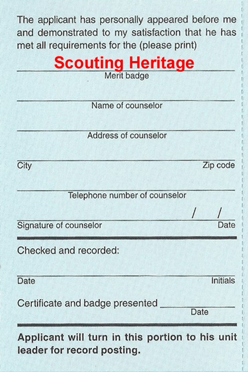
{{^}}

In the left section on the first line you need to fill in the name of the Merit Badge that this blue card will be for.  Just one thing in this section.  We will come back and fill in the rest at a later time, so don’t worry about the rest of the items in this section at this time.

Shown here is a sample of what this section should look like when you are finished with this step.

{{/figure-container}}

{{#figure-container align="right" position="top"}}
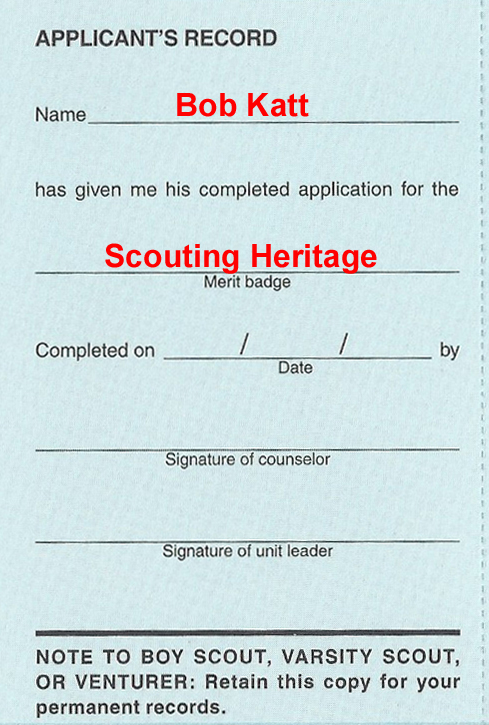
{{^}}

Now to the center section, there are only two items you need to fill out at this time.

The first item is your name, and like on the other side of the blue card, you need to fill out your complete name.

The second item in this section is the next line down, which is the Merit Badge that this blue card will be for.  Again the other items in this section are to be filled out at a later time, so don’t worry about them now.

{{/figure-container}}

{{#figure-container align="right" position="top"}}
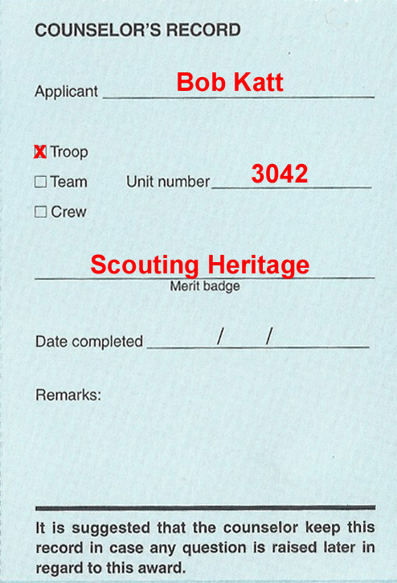
{{^}}

You are almost done. There are three things to complete on the right section.  These three items start with your complete name on the first line.

Next check Troop, Team or Crew based on what type of unit you are associated with followed by your unit’s number.

Finally, fill in the merit badge that this blue card will be used for on the line labeled, Merit Badge.

{{/figure-container}}

## Am I done yet?  Not Quite.

Now you need to take your blue card to your Scoutmaster and get his / her signature on it.  According to the Scoutmaster Handbook, a Scout needs to be signed off on his blue card by the Scoutmaster BEFORE beginning work on a merit badge. This is an important step.  Your Scoutmaster’s signature is an official approval to work on any merit badge.

This process also offers you and your Scoutmaster the opportunity to discuss any questions or concerns either of you might have regarding your commitment to working towards completing this merit badge.  Your Scoutmaster will be able to provide you with people and resources that may assist you in working on the requirements for this merit badge; namely troop or district merit badge counselors for you to contact.  Your Scoutmaster may also share concerns or challenges he / she might know of or foresee that you may need to be aware of.  As of 2012, Scoutmasters are to provide at least one recommendation for a Merit Badge counselor during this review.

Finally, your Scoutmaster’s signature serves as a means of helping your merit badge counselor know that you are a currently registered Scout in a properly registered unit.

{{#figure-container align="right" position="top"}}
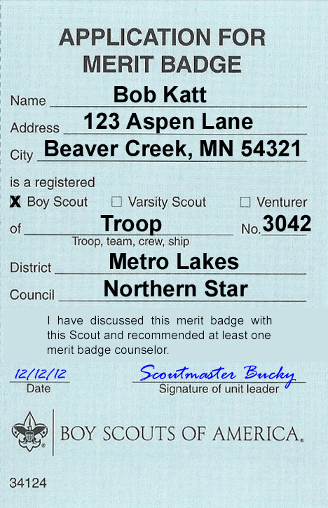
{{^}}

Make sure you know where your Scoutmaster needs to sign the blue card.  Turn to the front side where you filled out all of your information at first in the right section.  Near the bottom of this section your Scoutmaster will date and sign your blue card.

{{/figure-container}}

## NOW you are ready to start working on your Merit Badge.

Scoutmaster Bucky wants to remind you that when working on ANY merit badge, it is extremely helpful to get the current merit badge pamphlet for the merit badge you are working on.  Your local Scout Shop has these for sale but you may also want to check with your Troop Librarian to see if your unit might have a copy in the unit library that you could use.

As you go through the merit badge pamphlet, you will find that most of the requirements are thoroughly explained with the contents of the merit badge pamphlet.

Often times Scouts find it helpful to use one of Scoutmaster Bucky’s specially made [Merit Badge Workbooks](/workbooks/) to help take notes and mark down their findings and accomplishments for the requirements of the merit badge they are working on.  You can download these off of www.ScoutmasterBucky.com.  NOTE: Merit Badge Workbooks are discouraged by the BSA and can NOT be used to show completion of work where the requirement does not specifically require a Scout to write out their work.

## Time to meet the Merit Badge Counselor

Once you have reviewed the Merit Badge Pamphlet and made your notes, you can assess what you have completed and ready yourself to meet with your merit badge counselor.  Remember, it is always best to be ready to show your merit badge counselor what you have done when you first meet with him or her.  During this meeting you may find that you have completed some of the requirement with your preparation work.  Your merit badge counselor will help direct you to other people or resources that might assist you in completing unfinished requirements.

## Completion of Requirements = Initials and Dates

Not only do you need to know what needs to be filled in by yourself, you should also know and understand what your Merit Badge Counselor needs to be responsible for.  Ultimately it is YOUR responsibility to make sure that your Blue Card is filled out correctly and completely.  Remember a Scout is kind and courteous, so if you find that your merit badge counselor appears to have omitted something or not completed something properly, you can, and should, politely inquiry for clarification.

{{#figure-container align="right" position="top"}}
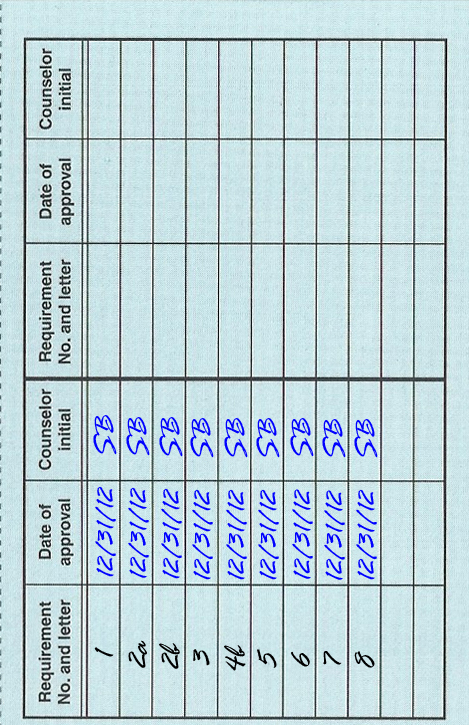
{{^}}

When you have completed a requirement to the satisfaction of your merit badge counselor, your merit badge counselor will sign off that you have completed the requirements by marking off on the middle section of the front side of the Blue Card.

You or your counselor may write down the requirement numbers and letters in the first column in this section for the specific merit badge.  Your merit badge counselor will then date and initial those requirements that you complete.
It is YOUR responsibility to make sure that your merit badge counselor completes this area completely and correctly.

{{/figure-container}}

After you have finished and been signed off on all your requirements, this front center section should have all the requirements for the merit badge listed with your counselors initials and dated.  You may have worked with multiple counselors on this merit badge, but you need to do a few things with the counselor that signs you off on your final requirement.

## You Still Need a Few Autographs

{{#figure-container align="right" position="top"}}
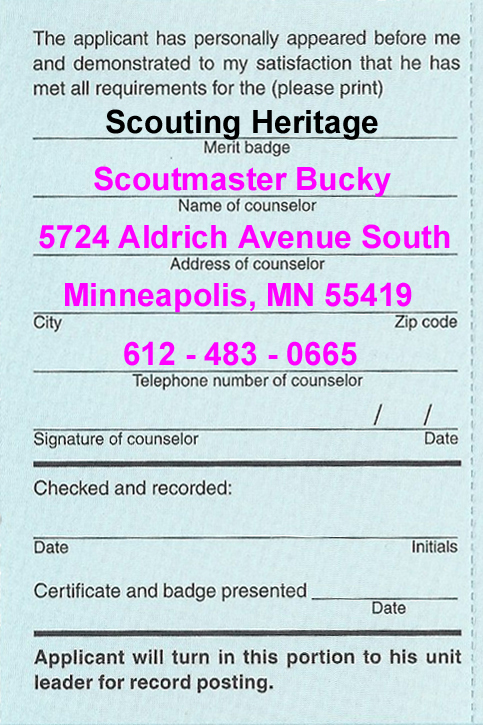
{{^}}

Now that all of your requirements have been initialed and dated, there are a couple of areas that need to be filled out to complete the earning of this merit badge.

Turn your blue card over to the back side and let’s start in the left section.

Here you will need to fill out the contact information of your merit badge counselor.  (Some merit badge counselors will do this for you) Remember it is your responsibility to make sure this is done correctly.

Fill out the counselor’s name, street address, city, state, and zip code along with the counselor’s telephone number.

This section should only contain the Counselor Information for the Merit Badge Counselor that is providing final sign off on the merit badge.

{{/figure-container}}

Many Scouters believe that a Scout must finish a merit badge with the same counselor they start it with. This is untrue.

Scouts should maintain contact information for all counselors that they have worked with on the merit badge. While it is recommended that only the counselor performing the final sign off is listed on the blue card, some Scouts may try and squeeze information for multiple counselors into this already tight space. When working with more than one counselor, Scouts should get into the practice of maintaining a piece of paper along with their blue card with counselor contact information on it.

{{#figure-container align="right" position="top"}}
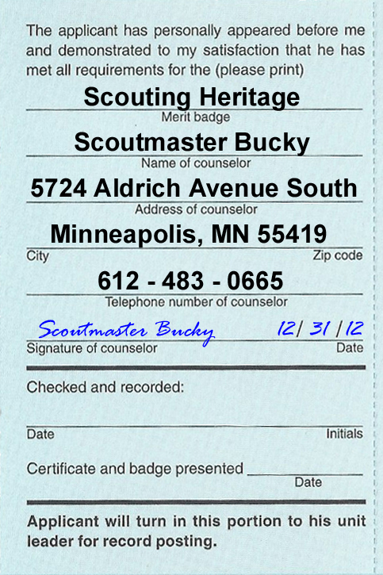
{{^}}

If a Scout is signed off on a requirement by one merit badge counselor, another merit badge counselor cannot retest or revoke the signed off requirement. However, if previous counselor contact information can not be validated, the merit badge counselor being asked to do the final sign off can review those requirements with the Scout.

Once the counselor is ready to sign off completion of the merit badge, the counselor’s signature is required on this left section along with the date of completion.

It is YOUR responsibility to make sure that your merit badge counselor signs and dates this section clearly and correctly.

{{/figure-container}}

{{#figure-container align="right" position="top"}}
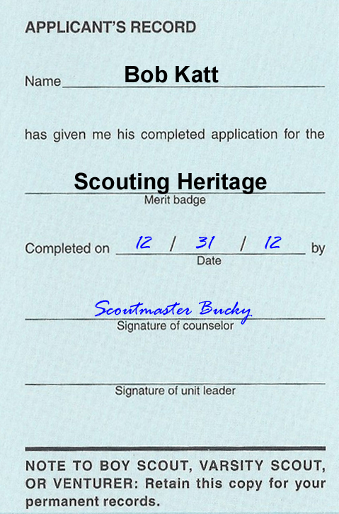
{{^}}

In the center section the merit badge counselor will need to enter the completion date and also sign off in this section as well.

{{/figure-container}}

{{#figure-container align="right" position="top"}}
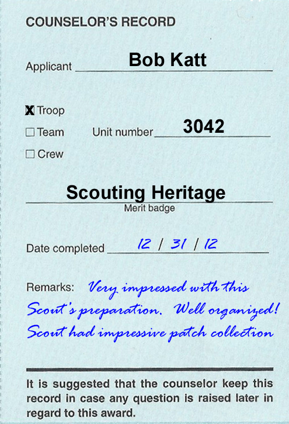
{{^}}

Finally on the right section your counselor will fill in the completion date and make any special notes.

You have now finished your merit badge, but you aren’t finished with your blue card.

Make sure your Merit badge counselor removes the right section of the card – labeled Counselor’s Record at the top, for his or her records.  You should get two of the three sections back and make sure you keep them connected.

{{/figure-container}}

## You're Almost Done

{{#figure-container align="right" position="top"}}
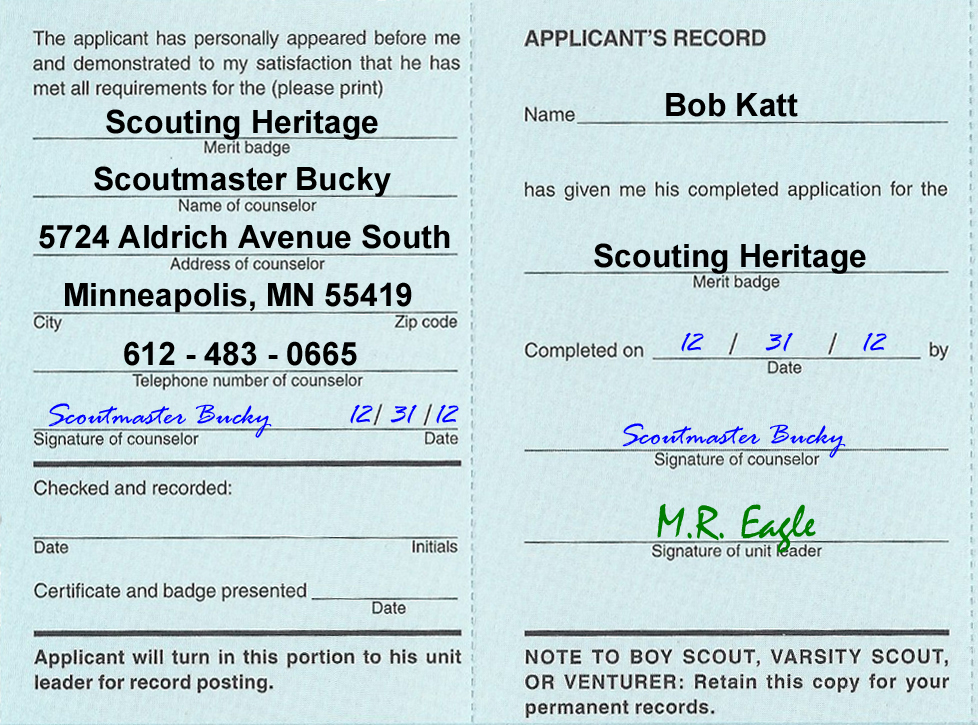
{{^}}

When you return to your next unit meeting, you will need to turn in these two sections of your blue card to your Scoutmaster or other designated person in your unit to show that you have completed your merit badge.  Your unit’s Advancement Chair will then process your Merit Badge Application and shortly thereafter you will be awarded your merit badge at the next suitable unit occasion.

Your Scoutmaster or Unit Advancement Coordinator will sign off at the bottom of the Applicant’s Record section.  This shows that the unit has received and processed your blue card.

{{/figure-container}}

## Record Keeping

{{#figure-container align="right" position="top"}}
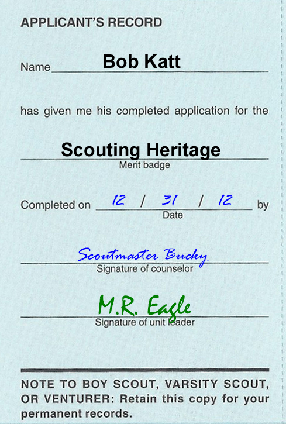
{{^}}

When you receive your merit badge you will get the center section of your blue card back.  You must keep this in a very safe place, do NOT throw it away.

When you go to your Eagle Board of Review you will need to bring all your blue cards with you to show the review board all of the merit badges you have completed.

Working on merit badges will cover a period of a number of years so it is important that you keep your blue cards in one, safe, organized location.  Many Scouts keep them in a special spot or even keep them in baseball card pages in a binder.

Whatever you choose, keep them safe and together.

{{/figure-container}}

## Congratulations

Congratulations. Scoutmaster Bucky wants to congratulate you on successfully completing your merit badge.

## Enlarged Sample Blue Card

    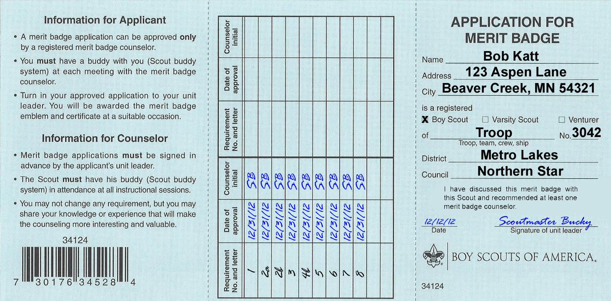
    
Front of Blue Card

    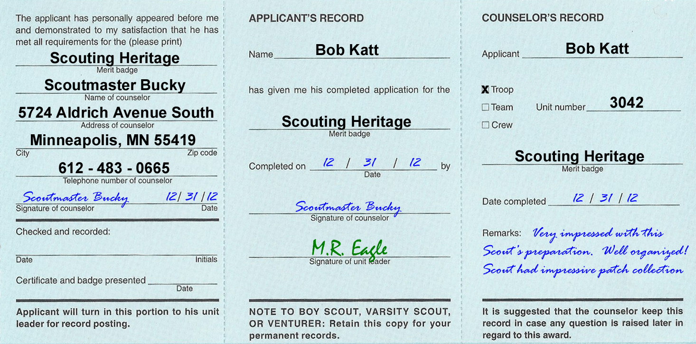
    
Back of Blue Card

