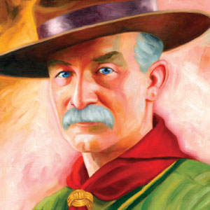
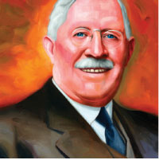
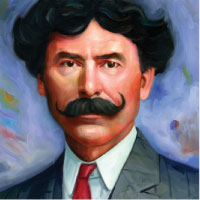

# Merit Badge History Pages

When one is asked about the icons of Scouting, the most commonly identified are: the campfire, the uniform, and merit badges. The merit badge program has delivered knowledge, skills and career awareness to millions of youth for the last 100 years.

The preface of Scouting for Boys, written in 1908, by Lord Robert Baden-Powell; the founder of the worldwide Scouting movement, included a description of the four components of the Scouting program. The second of those components was, “Handicrafts or hobbies which may help a boy to make his way in life, for which we give ‘Proficiency’ badges”

In 1910, the American Scouting movement was incorporated by William D Boyce and others. The original edition of The Official Handbook for Boys was published in 1911 to standardize the program. In addressing merit badges, known at that time as Badges of Merit, the manual stated, “These badges are intended to stimulate the boy’s interest in the life about him and are given for general knowledge”. That purpose has changed little since those early days. Recent editions of the Boy Scout Handbook stated, “A merit badge is an invitation to explore an exciting subject... some merit badges encourage you to increase your skill in subjects you already like, while others challenge you to learn about new areas of knowledge ... a merit badge can even lead you toward a lifelong hobby or set you on the way to a rewarding career”

Ernest Thompson-Seton, an author, nature artist, and naturalist from New York, was commissioned to adapt Scouting for Boys into a manual for the new BSA organization and his 1910 publication included 14 Badges of Merit. The following year, a more comprehensive manual was released by the BSA and is considered the original handbook. The Official Handbook for Boys listed 57 different merit badges available to Scouts. From that point on, national leaders of the organization have considered and approved merit badges on subjects that interest boys and helped to achieve the purposes of the BSA.

## Merit Badge History Pages

{{#each meritBadges}}

<a href="{{@root.rootPath}}merit-badges/{{@key}}/history/">{{name}}</a>

{{/each}}

