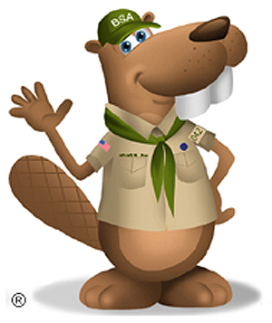

Welcome from Scoutmaster Bucky

Serving Scouts since January 2009

Remember the Scout Motto: <smb-accent>Be Prepared</smb-accent>

at Scoutmaster Bucky events this is not a request, wish, or desire…

<smb-accent>it is an expectation.</smb-accent>

<!--

Dungeons &amp; Dragons

Join Scoutmaster Bucky and his team of Dungeon Masters on October 5th.

<a href="/dnd/">Learn more!</a>

-->

{{#if news}}

## News

{{#figure-container align="left" position="top"}}

{{^}}

{{#news}}

NEW!

{{.}}

{{/news}}
{{/figure-container}}
{{/if}}

## Upcoming Events

{{#ancestry.childrenByName.events.ancestry.members}}
{{>event-tile event=.}}
{{/ancestry.childrenByName.events.ancestry.members}}

## Disclaimer

The Scoutmaster Bucky program is a volunteer run program managed and maintained entirely by Brian Reiners (Scoutmaster Bucky) in conjunction with the council of Northern Star Scouting and other Scouting volunteers. All content, scheduling, arrangements, and the like are managed by Scoutmaster Bucky. All proceeds collected go to cover program expenses and operating costs (including but not limited to building rentals, program materials, class materials, and technology support), with any profits (when and if there are any) put back into the Scouting program annually.

## Policies & Contact Information

{{#figure-container}}

{{^}}
Requests for refunds or cancellations will be honored up to a week prior to any Scoutmaster Bucky event.

Due to the high demand, only one Eagle-required merit badge is allowed per Scout per opportunity.

Scoutmaster Bucky is Brian Reiners and is registered in Northern Star Scouting of the Boy Scouts of America.

Contact number: 612-483-0665 
Email: <a href="mailto:ScoutmasterBucky@yahoo.com?subject=Home Page Inquiry">ScoutmasterBucky@yahoo.com</a>

Learn more about [being a counselor for Bucky](/counselors/).

Last Update: {{#date}}{{buildDate}}{{/date}}

{{/figure-container}}
