{{#requirements}}
1. Give a brief history of the bugle.
    {{#note type="inPerson" type2="online"}}Scouts should have this written out to show the counselor that some thought and research has gone into this requirement and Scouts should be prepared to discuss their findings. Scouts will not automatically be signed off on this requirement just for attending as the requirement states that they must give a brief history of the bugle.{{/note}}
2. Do the following:
    (a) Explain and demonstrate how the bugle makes sound, and explain how the bugle is related to other brass wind instruments.
    (b) Compose a bugle call for your troop or patrol to signal a common group activity, such as assembling for mealtime or striking a campsite. Play the call that you have composed before your unit or patrol.
    {{#note type="inPerson" type2="online"}}Scouts should review this requirement and its components and be ready to demonstrate their fulfillment of this requirement in the class.{{/note}}
3. Sound 10 of the following bugle calls: "First Call," "Reveille," "Assembly," "Mess," "Drill," "Fatigue," "Officers," "Recall," "Church," "Swimming," "Fire," "Retreat," "To the Colors," "Call to Quarters," and "Taps."
    {{#note type="inPerson" type2="online"}}Scouts should begin practicing these bugle calls immediately so that during the class they may make the most of their time with the counselor. Scouts should not expect to become proficient during the class on any of these bugle calls. Preparation and practice are a MUST.{{/note}}
    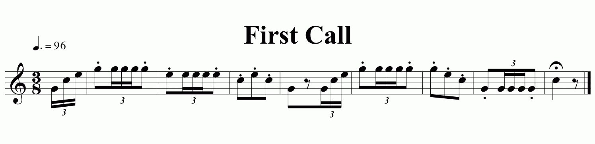
    
<a href="workbook/first-call.mp3">Listen to First Call</a>

    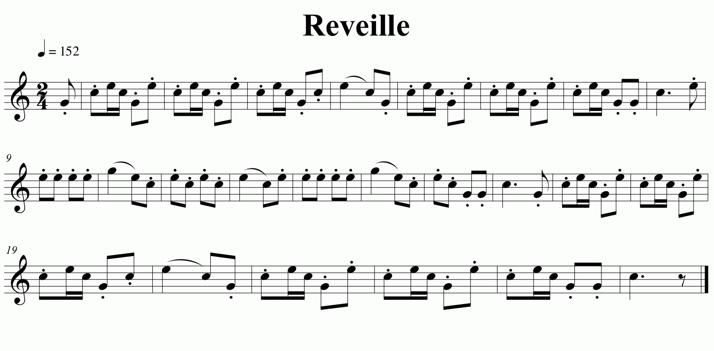
    
<a href="workbook/revelle.mp3">Listen to Revelle</a>

    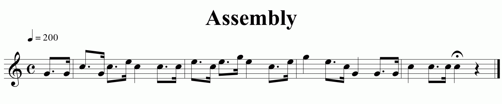
    
<a href="workbook/assembly.mp3">Listen to Assembly</a>

    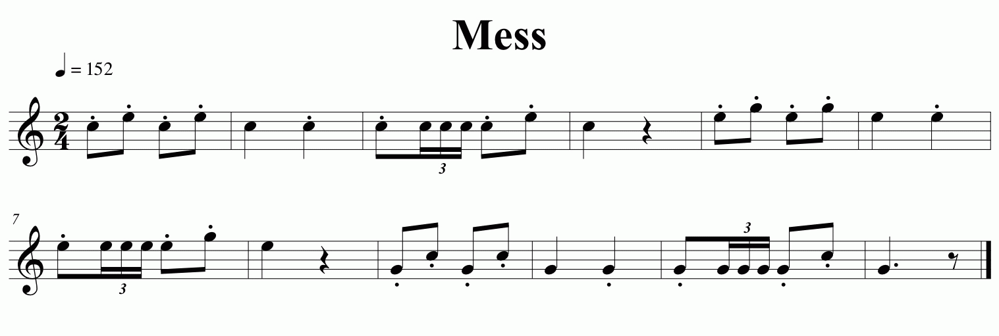
    
<a href="workbook/mess.mp3">Listen to Mess</a>

    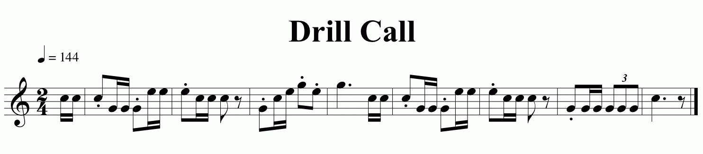
    
<a href="workbook/drill-call.mp3">Listen to Drill Call</a>

    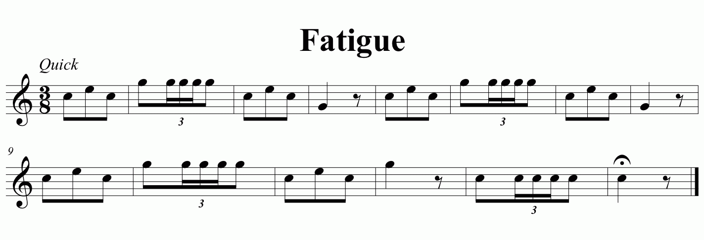
    
<a href="workbook/fatigue.mp3">Listen to Fatigue</a>

    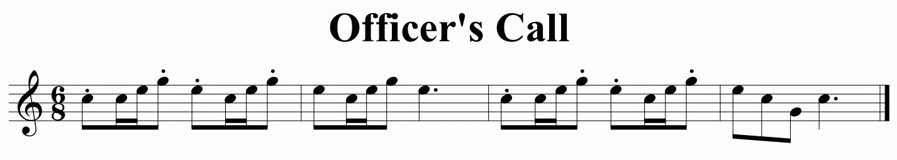
    
<a href="workbook/officers-call.mp3">Listen to Officer's Call</a>

    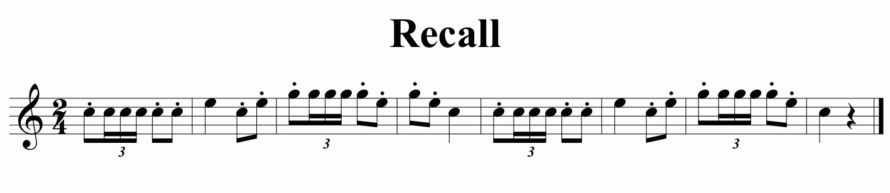
    
<a href="workbook/recall.mp3">Listen to Recall</a>

    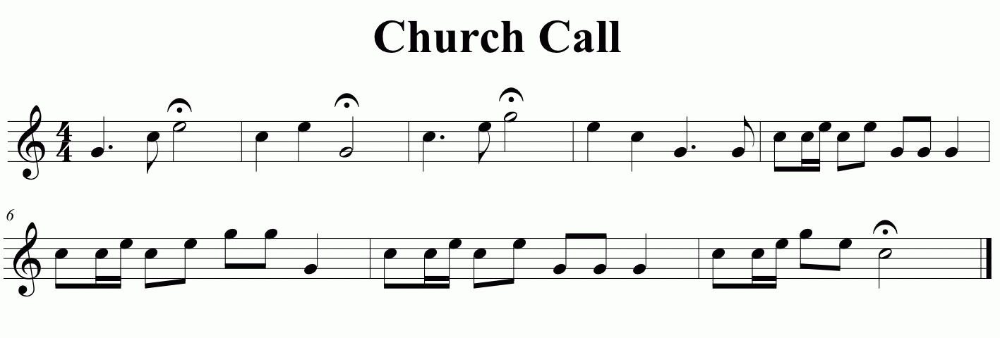
    
<a href="workbook/church-call.mp3">Listen to Church Call</a>

    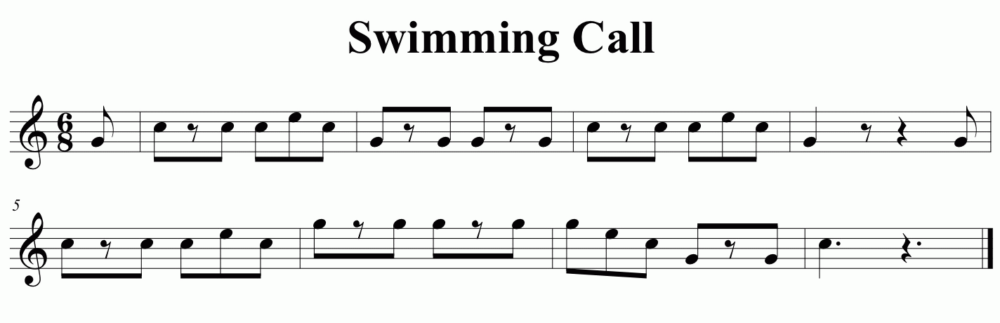
    
<a href="workbook/swimming-call.mp3">Listen to Swimming Call</a>

    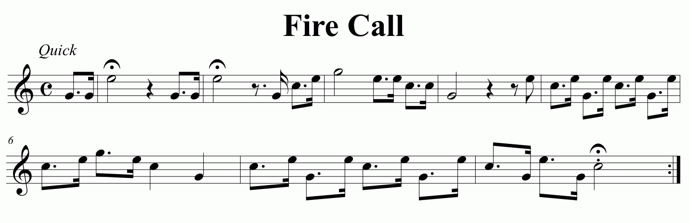
    
<a href="workbook/fire-call.mp3">Listen to Fire Call</a>

    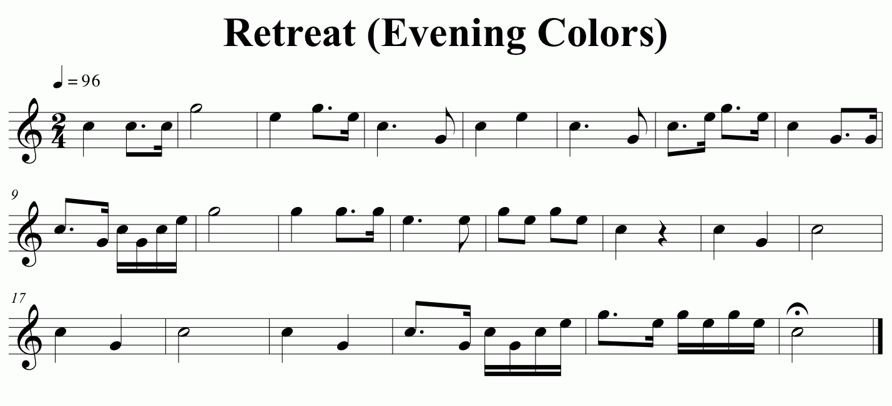
    
<a href="workbook/retreat-evening-colors.mp3">Listen to Retreat (Evening Colors)</a>

    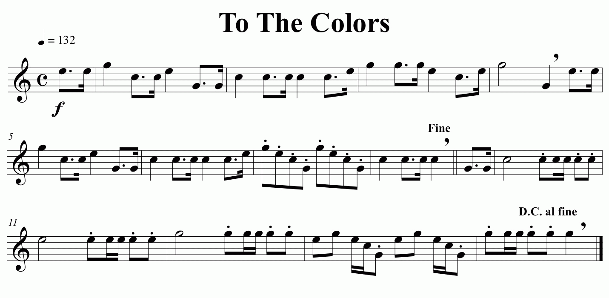
    
<a href="workbook/to-the-colors.mp3">Listen to To The Colors</a>

    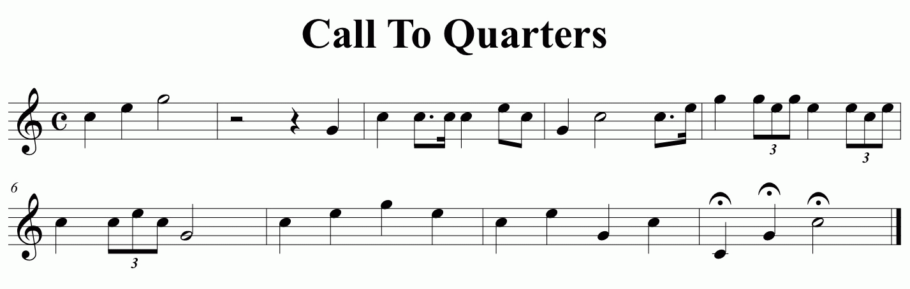
    
<a href="workbook/call-to-quarters.mp3">Listen to Call to Quarters</a>

4. Explain the use of each of the calls you performed.
    {{#note type="inPerson" type2="online"}}Scouts will spend time in the class working on this requirement. It is strongly recommended for ensuring the best opportunity of receiving credit for this requirement that Scouts bring their notes and research in an ordered format to help facilitate their explanation during the class..{{/note}}
5. Explain how to care for, clean, and maintain a bugle.
    {{#note type="inPerson" type2="online"}}Scouts should review this requirement and its components and be ready to demonstrate their fulfillment of this requirement in the class..{{/note}}
6. Serve as bugler in your troop for three months.
    *NOTE: A bugle, trumpet, or cornet may be used to meet these requirements.*
    {{#note type="inPerson" type2="online"}}Obviously, this requirement can NOT be completed as part of the class. However, Scouts having served successfully as their Troop Bugler should bring a note signed by their Scoutmaster AND Senior Patrol Leader for consideration by the counselor for sign off at the class if they have completed this requirement.{{/note}}
{{/requirements}}
