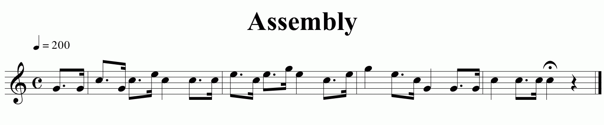
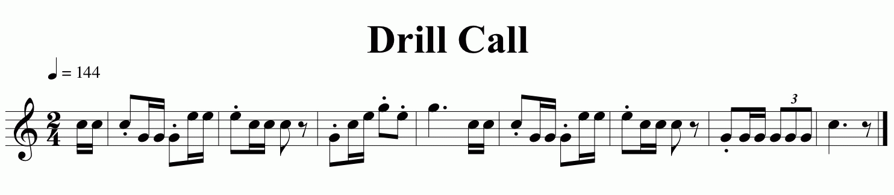
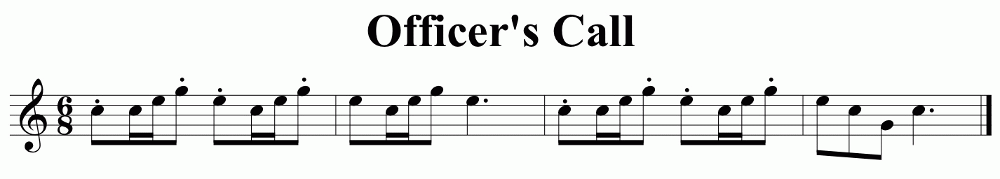
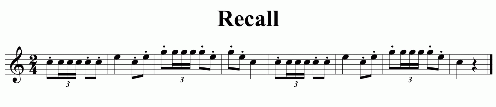
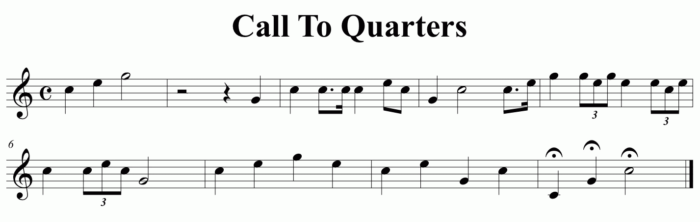

{{#wb-req item="1" requirement="Give a brief history of the bugle."}}
{{#wb-req-text lines=8}}{{/wb-req-text}}
{{/wb-req}}

{{#wb-req item="2" requirement="Do the following:"}}
{{#wb-req-text lines=8}}{{/wb-req-text}}
{{/wb-req}}

{{#wb-req item="2a" requirement="Explain and demonstrate how the bugle makes sound, and explain how the bugle is related to other brass wind instruments."}}
{{#wb-req-text lines=8}}{{/wb-req-text}}
{{/wb-req}}

{{#wb-req item="2b" requirement="Compose a bugle call for your troop or patrol to signal a common group activity, such as assembling for mealtime or striking a campsite. Play the call that you have composed before your unit or patrol."}}
{{#wb-req-text lines=8}}{{/wb-req-text}}
{{#wb-req-area}}

{{/wb-req-area}}
{{/wb-req}}

{{#wb-req item="3" requirement="Sound 10 of the following bugle calls: \"First Call,\" \"Reveille,\" \"Assembly,\" \"Mess,\" \"Drill,\" \"Fatigue,\" \"Officers,\" \"Recall,\" \"Church,\" \"Swimming,\" \"Fire,\" \"Retreat,\" \"To the Colors,\" \"Call to Quarters,\" and \"Taps.\""}}
{{/wb-req}}
{{#wb-req item="4" requirement="Explain the use of each of the calls you performed."}}
{{! ----- First Call ----- }}
{{#wb-req-area}}

<a href="first-call.mp3">Listen to First Call</a>

{{/wb-req-area}}
{{#wb-req-text lines=8}}How this call is used:{{/wb-req-text}}
{{! ----- Revelle ----- }}
{{#wb-req-area}}

<a href="revelle.mp3">Listen to Revelle</a>

{{/wb-req-area}}
{{#wb-req-text lines=8}}How this call is used:{{/wb-req-text}}
{{! ----- Assembly ----- }}
{{#wb-req-area}}

<a href="assembly.mp3">Listen to Assembly</a>

{{/wb-req-area}}
{{#wb-req-text lines=8}}How this call is used:{{/wb-req-text}}
{{! ----- Mess ----- }}
{{#wb-req-area}}

<a href="mess.mp3">Listen to Mess</a>

{{/wb-req-area}}
{{#wb-req-text lines=8}}How this call is used:{{/wb-req-text}}
{{! ----- Drill Call ----- }}
{{#wb-req-area}}

<a href="drill-call.mp3">Listen to Drill Call</a>

{{/wb-req-area}}
{{#wb-req-text lines=8}}How this call is used:{{/wb-req-text}}
{{! ----- Fatigue ----- }}
{{#wb-req-area}}

<a href="fatigue.mp3">Listen to Fatigue</a>

{{/wb-req-area}}
{{#wb-req-text lines=8}}How this call is used:{{/wb-req-text}}
{{! ----- Officer's Call ----- }}
{{#wb-req-area}}

<a href="officers-call.mp3">Listen to Officer's Call</a>

{{/wb-req-area}}
{{#wb-req-text lines=8}}How this call is used:{{/wb-req-text}}
{{! ----- Recall ----- }}
{{#wb-req-area}}

<a href="recall.mp3">Listen to Recall</a>

{{/wb-req-area}}
{{#wb-req-text lines=8}}How this call is used:{{/wb-req-text}}
{{! ----- Church Call ----- }}
{{#wb-req-area}}

<a href="church-call.mp3">Listen to Church Call</a>

{{/wb-req-area}}
{{#wb-req-text lines=8}}How this call is used:{{/wb-req-text}}
{{! ----- Swimming Call ----- }}
{{#wb-req-area}}

<a href="swimming-call.mp3">Listen to Swimming Call</a>

{{/wb-req-area}}
{{#wb-req-text lines=8}}How this call is used:{{/wb-req-text}}
{{! ----- Fire Call ----- }}
{{#wb-req-area}}

<a href="fire-call.mp3">Listen to Fire Call</a>

{{/wb-req-area}}
{{#wb-req-text lines=8}}How this call is used:{{/wb-req-text}}
{{! ----- Retreat (Evening Colors) ----- }}
{{#wb-req-area}}

<a href="retreat-evening-colors.mp3">Listen to Retreat (Evening Colors)</a>

{{/wb-req-area}}
{{#wb-req-text lines=8}}How this call is used:{{/wb-req-text}}
{{! ----- To The Colors ----- }}
{{#wb-req-area}}

<a href="to-the-colors.mp3">Listen to To The Colors</a>

{{/wb-req-area}}
{{#wb-req-text lines=8}}How this call is used:{{/wb-req-text}}
{{! ----- Call to Quarters ----- }}
{{#wb-req-area}}

<a href="call-to-quarters.mp3">Listen to Call to Quarters</a>

{{/wb-req-area}}
{{#wb-req-text lines=8}}How this call is used:{{/wb-req-text}}
{{! ----- Taps ----- }}
{{#wb-req-area}}

<a href="taps.mp3">Listen to Taps</a>

{{/wb-req-area}}
{{#wb-req-text lines=8}}How this call is used:{{/wb-req-text}}
{{! ----- Done with calls ----- }}
{{/wb-req}}

{{#wb-req item="5" requirement="Explain how to care for, clean, and maintain a bugle."}}
{{#wb-req-text lines=8}}{{/wb-req-text}}
{{/wb-req}}

{{#wb-req item="6" requirement="Serve as bugler in your troop for three months."}}
{{#wb-req-text lines=8}}{{/wb-req-text}}
{{/wb-req}}

*NOTE: A bugle, trumpet, or cornet may be used to meet these requirements.*
