{{#wb-requirement item="1"}}Understand how coins are made, and where the active U.S. Mint facilities are located.{{/wb-requirement}}
{{#wb-text-entry lines=5}}How coins are made:{{/wb-text-entry}}
{{#wb-text-entry lines=5}}List all U.S. Mint facilities here:{{/wb-text-entry}}

{{#wb-requirement item="2"}}Explain these collecting terms: (2a) Obverse, (2b) Reverse, (2c) Reeding, (2d) Clad, (2e) Type set, (2f) Date set{{/wb-requirement}}
{{#wb-text-entry lines=4}}Obverse:{{/wb-text-entry}}
{{#wb-text-entry lines=4}}Reverse:{{/wb-text-entry}}
{{#wb-text-entry lines=4}}Reeding:{{/wb-text-entry}}
{{#wb-text-entry lines=4}}Clad:{{/wb-text-entry}}
{{#wb-text-entry lines=4}}Type set:{{/wb-text-entry}}
{{#wb-text-entry lines=4}}Date set:{{/wb-text-entry}}

{{#wb-requirement item="3"}}Explain the grading terms Uncirculated, Extremely Fine, Very Fine, Fine, Very Good, Good, and Poor.{{/wb-requirement}}
{{#wb-text-entry lines=4}}Uncirculated:{{/wb-text-entry}}
{{#wb-text-entry lines=4}}Extremely fine:{{/wb-text-entry}}
{{#wb-text-entry lines=4}}Very fine:{{/wb-text-entry}}
{{#wb-text-entry lines=4}}Fine:{{/wb-text-entry}}
{{#wb-text-entry lines=4}}Very good:{{/wb-text-entry}}
{{#wb-text-entry lines=4}}Good:{{/wb-text-entry}}
{{#wb-text-entry lines=4}}Poor:{{/wb-text-entry}}

{{#wb-requirement item="3"}}Show five different grade examples of the same coin type.{{/wb-requirement}}
{{#wb-area class="D(f)"}}

Grade and Notes

Grade and Notes

{{/wb-area}}
{{#wb-area class="D(f)"}}

Grade and Notes

Grade and Notes

Grade and Notes

{{/wb-area}}

{{#wb-requirement item="3"}}Explain the term *proof* and why it is not a grade.{{/wb-requirement}}
{{#wb-text-entry lines=8}}{{/wb-text-entry}}

{{#wb-requirement item="3"}}Tell what encapsulated coins are.{{/wb-requirement}}
{{#wb-text-entry lines=8}}{{/wb-text-entry}}

{{#wb-requirement item="4"}}Know three different ways to store a collection, and describe the benefits, drawbacks, and expense of each method. Pick one to use when completing requirements.{{/wb-requirement}}
{{#wb-short-entry}}Storage method #1:{{/wb-short-entry}}
{{#wb-text-entry lines=4}}Benefits:{{/wb-text-entry}}
{{#wb-text-entry lines=4}}Drawbacks:{{/wb-text-entry}}
{{#wb-text-entry lines=4}}Expenses:{{/wb-text-entry}}
{{#wb-text-entry lines=4}}Notes:{{/wb-text-entry}}

{{#wb-requirement item="4"}}Know three different ways to store a collection, and describe the benefits, drawbacks, and expense of each method. Pick one to use when completing requirements.{{/wb-requirement}}
{{#wb-short-entry}}Storage method #2:{{/wb-short-entry}}
{{#wb-text-entry lines=4}}Benefits:{{/wb-text-entry}}
{{#wb-text-entry lines=4}}Drawbacks:{{/wb-text-entry}}
{{#wb-text-entry lines=4}}Expenses:{{/wb-text-entry}}
{{#wb-text-entry lines=4}}Notes:{{/wb-text-entry}}

{{#wb-requirement item="4"}}Know three different ways to store a collection, and describe the benefits, drawbacks, and expense of each method. Pick one to use when completing requirements.{{/wb-requirement}}
{{#wb-short-entry}}Storage method #3:{{/wb-short-entry}}
{{#wb-text-entry lines=4}}Benefits:{{/wb-text-entry}}
{{#wb-text-entry lines=4}}Drawbacks:{{/wb-text-entry}}
{{#wb-text-entry lines=4}}Expenses:{{/wb-text-entry}}
{{#wb-text-entry lines=4}}Notes:{{/wb-text-entry}}

{{#wb-alert}}Do one of the following (5a or 5b) for requirement 5{{/wb-alert}}

{{#wb-requirement item="5a"}}Demonstrate to your counselor that you know how to use two U.S. or world coin reference catalogs.{{/wb-requirement}}
{{#wb-with-counselor}}Be sure to bring your catalogs for your demonstration with your merit badge counselor{{/wb-with-counselor}}

{{#wb-requirement item="5b"}}Read a numismatic magazine or newspaper and tell your counselor about what you learned.{{/wb-requirement}}
{{#wb-short-entry}}Magazine or newspaper:{{/wb-short-entry}}
{{#wb-text-entry lines=8}}Notes:{{/wb-text-entry}}

{{#wb-requirement item="6"}}Describe the 1999-2008 50 State Quarters program or the America the Beautiful Quarters program.{{/wb-requirement}}
{{#wb-text-entry lines=2}}Notes:{{/wb-text-entry}}

{{#wb-requirement item="6"}}Collect and show your counselor five different quarters from circulation you have acquired from one of these programs.{{/wb-requirement}}
{{#wb-area class="D(f)"}}

Quarter 1

Quarter 2

Quarter 3

Quarter 4

Quarter 5

{{/wb-area}}

{{#wb-requirement item="7"}}Collect from circulation a set of current U.S. coins. Include one coin of each denomination (cent, nickel, dime, quarter, half dollar, dollar). For each coin, locate the mint marks, if any, and the designer's initials, if any.{{/wb-requirement}}
{{#wb-area class="D(f)"}}

Penny

Nickel

Dime

{{/wb-area}}
{{#wb-area class="D(f)"}}

Quarter

Half Dollar

Dollar

{{/wb-area}}
{{#wb-area class="D(f)"}}

Dollar

Other

Other

{{/wb-area}}

{{#wb-requirement item="8a"}}Identify the people depicted on the following denominations of current U.S. paper money: $1, $2, $5, $10, $20, $50, and $100.{{/wb-requirement}}
{{#wb-area}}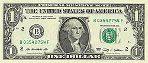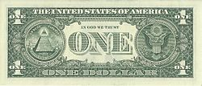{{/wb-area}}
{{#wb-area}}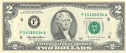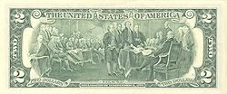{{/wb-area}}
{{#wb-area}}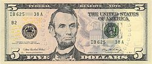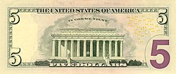{{/wb-area}}
{{#wb-area}}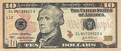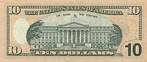{{/wb-area}}
{{#wb-area}}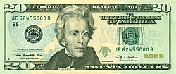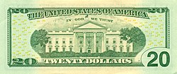{{/wb-area}}
{{#wb-area}}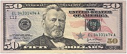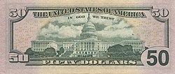{{/wb-area}}
{{#wb-area}}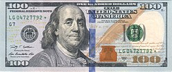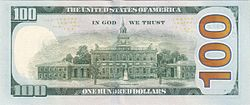{{/wb-area}}

{{#wb-special class="D(f) Fxw(w) Ai(c) P(1em)"}}

Just for Fun

These denominations are no longer printed but still are considered legal tender when circulated.

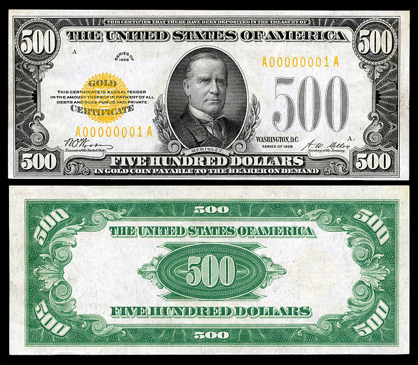

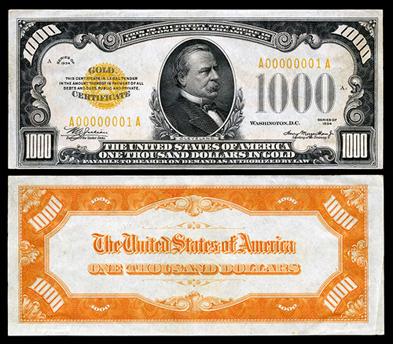

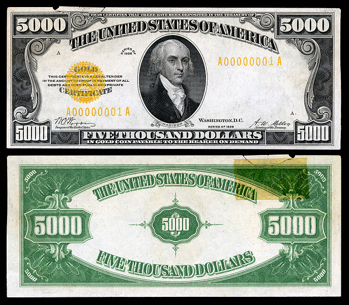

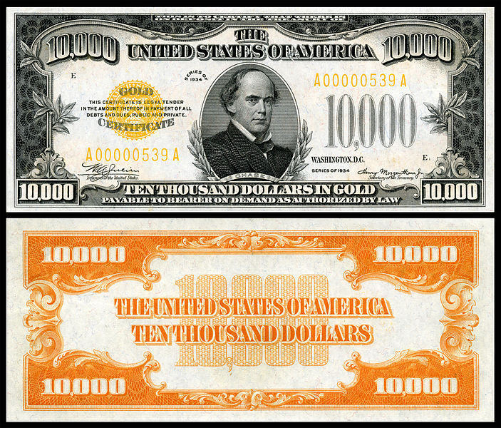

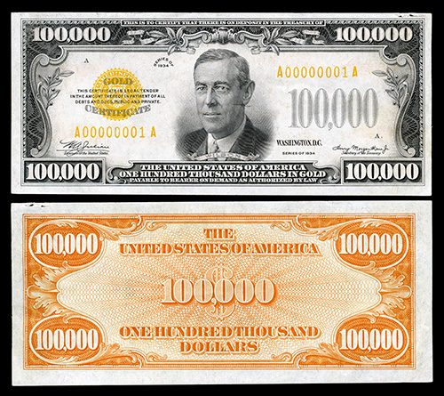

{{/wb-special}}

{{#wb-requirement item="8b"}}Explain “legal tender.”{{/wb-requirement}}
{{#wb-text-entry lines=8}}{{/wb-text-entry}}

{{#wb-requirement item="8c"}}Describe the role the Federal Reserve System plays in the distribution of currency.{{/wb-requirement}}
{{#wb-text-entry lines=8}}{{/wb-text-entry}}

{{#wb-alert}}Do ONE of the following (9a, 9b, 9c, or 9d) for requirement 9:{{/wb-alert}}

{{#wb-requirement item="9a"}}Collect and identify 50 foreign coins from at least 10 different countries.{{/wb-requirement}}
{{#wb-note}}If selected, this requirement will need you to share your work with your counselor and does not require any workbook entry.{{/wb-note}}

{{#wb-requirement item="9b"}}Collect and identify 20 bank notes from at least five different countries.{{/wb-requirement}}
{{#wb-note}}If selected, this requirement will need you to share your work with your counselor and does not require any workbook entry.{{/wb-note}}

{{#wb-requirement item="9c"}}Collect and identify 15 different tokens or medals.{{/wb-requirement}}
{{#wb-note}}If selected, this requirement will need you to share your work with your counselor and does not require any workbook entry.{{/wb-note}}

{{#wb-requirement item="9d"}}For each year since the year of your birth, collect a date set of a single type of coin.{{/wb-requirement}}
{{#wb-note}}If selected, this requirement will need you to share your work with your counselor and does not require any workbook entry.{{/wb-note}}

{{#wb-alert}}Do ONE of the following (10a, 10b, 10c, or 10d) for requirement 10:{{/wb-alert}}

{{#wb-requirement item="10a"}}Tour a U.S. Mint facility, a Bureau of Engraving and Printing facility, a Federal Reserve bank, or a numismatic museum or exhibit, and describe what you learned to your counselor.{{/wb-requirement}}
{{#wb-short-entry}}Toured or visited place:{{/wb-short-entry}}
{{#wb-short-entry}}Visited date:{{/wb-short-entry}}
{{#wb-text-entry lines=8}}Notes:{{/wb-text-entry}}

{{#wb-requirement item="10b"}}With your parent's permission, attend a coin show or coin club meeting, or view the website of the U.S. Mint or a coin dealer, and report what you learned.{{/wb-requirement}}
{{>wb-parent-signature}}
{{#wb-short-entry}}Coin show, coin club meeting, or web site visited:{{/wb-short-entry}}
{{#wb-short-entry}}Visited date:{{/wb-short-entry}}
{{#wb-text-entry lines=8}}Notes:{{/wb-text-entry}}

{{#wb-requirement item="10c"}}Give a talk about coin collecting to a group such as your troop, a Cub Scout pack, or your class at school.{{/wb-requirement}}
{{#wb-short-entry}}Group addressed:{{/wb-short-entry}}
{{#wb-short-entry}}Talk date:{{/wb-short-entry}}
{{#wb-text-entry lines=8}}Notes:{{/wb-text-entry}}

{{#wb-requirement item="10d"}}Do drawings of five Colonial-era U.S. coins.{{/wb-requirement}}
{{#wb-area class="D(f)"}}

Coin 1

Coin 2

{{/wb-area}}
{{#wb-area class="D(f)"}}

Coin 3

Coin 4

Coin 5

{{/wb-area}}
