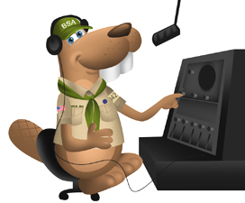

## Resources

{{#figure}}{{/figure}}
* [Radio Workbook - Amateur Radio Option](radio-workbook-amateur-radio.pdf)
* [Radio Workbook - Broadcasting Option](radio-workbook-broadcasting.pdf)
* [Radio Workbook - Directing Finding Option](radio-workbook-direction-finding.pdf)
* [Radio Workbook - Shortwave and Medium-Wave Listening Option](radio-workbook-shortwave-and-medium-wave-listening.pdf)
