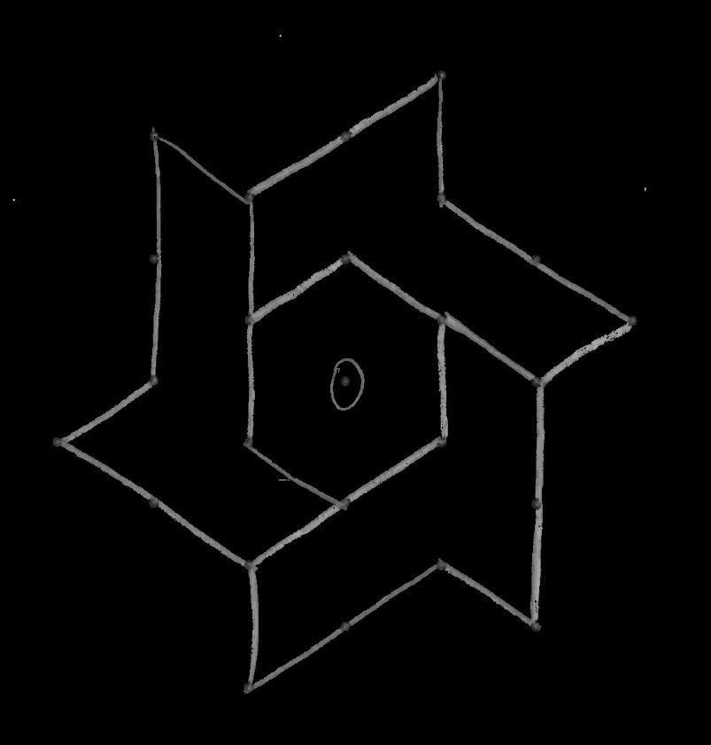
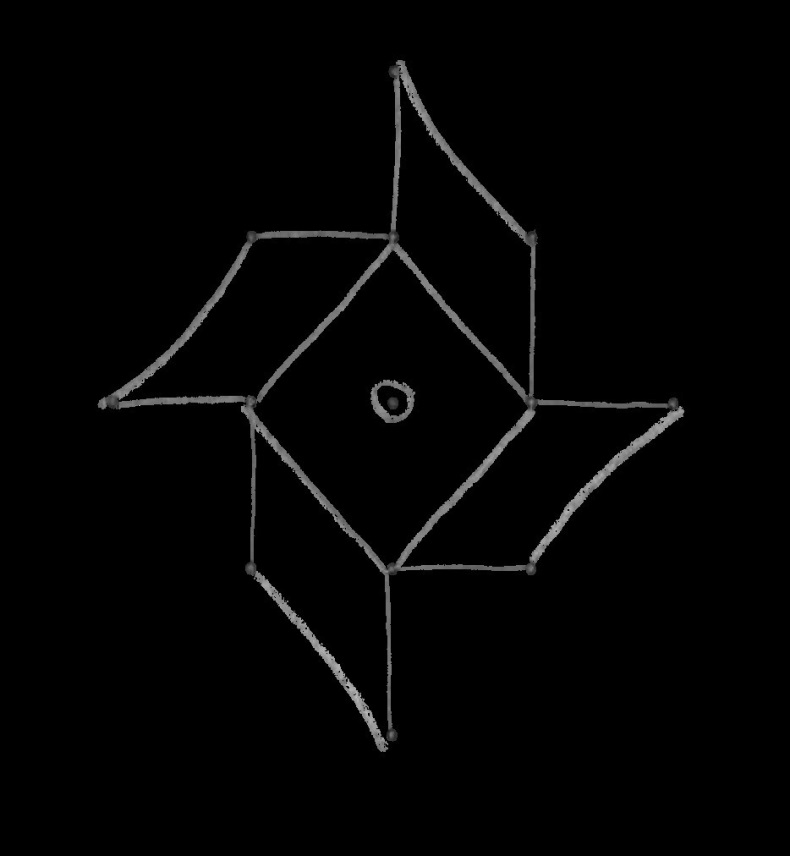
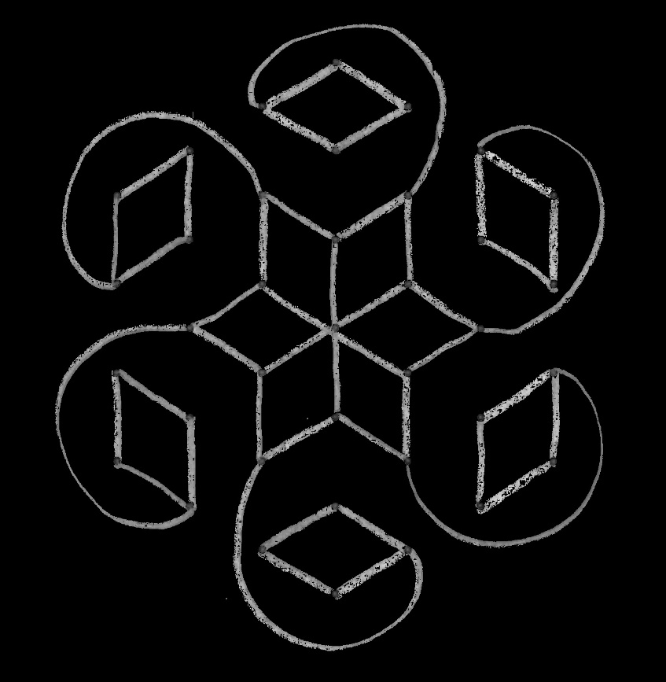
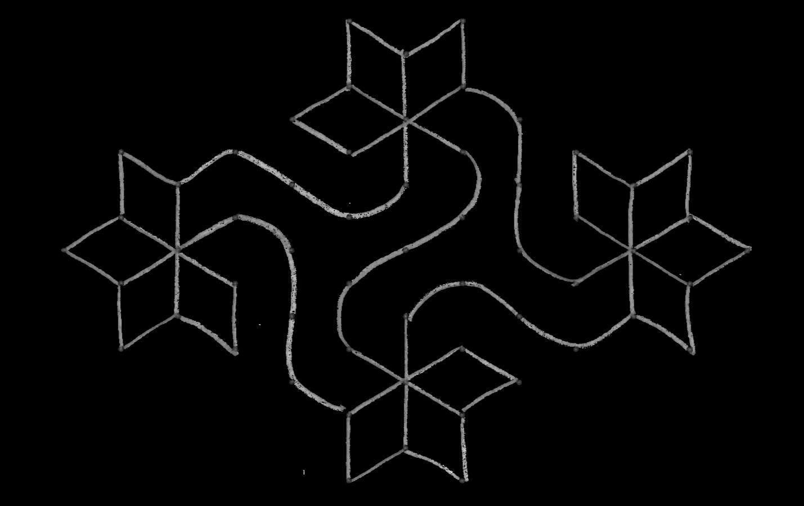

This module is designed to help you explore how symmetry affects your life each day. Symmetry is something for which most people have an intuitive feel, but many have never thought about in enough detail to give names to all that they see. Symmetry is a way that a figure is like itself. Perhaps one side is a mirror image of the other (reflectional symmetry). Perhaps if you turned the image a little, you would get the same pattern (rotational symmetry). Perhaps there is a repeated pattern along a line, so that if you moved one “space” down, the pattern would repeat (translational symmetry).

Perhaps there is some combination of these. A common pattern is that the pattern repeats if you move down the line and reflect across the line, as happens with alternating leaf arrangement on a plant (glide reflection symmetry). There are far more patterns than names.

Symmetry is everywhere. Minerals organize themselves in crystals, which are repeating patterns. Plants and animals have many interesting symmetries in their shapes. Most artistic traditions in the world, and many activities where people design a shape for its function, depend on some form of symmetry. In this award, Scouts get to explore many aspects of this topic.

{{#requirements}}
1. Choose A or B or C and complete ALL the requirements.
    A. Watch an episode or episodes (about one hour total) of a show that involves symmetry, mirrors, or artistic patterns. Then do the following:
        1) Make a list of at least two questions or ideas from what you watched.
        2) Discuss two of the questions or ideas with your counselor.
    B. Read (about one hour total) about anything that involves symmetry, mirrors, or artistic patterns. Then do the following:
        1) Make a list of at least two questions or ideas from what you read.
        2) Discuss two of the questions or ideas with your counselor.
    C. Do a combination of reading and watching (about one hour total) about anything that involves symmetry, mirrors, or artistic patterns. Then do the following:
        1) Make a list of at least two questions or ideas from what you read and watched.
        2) Discuss two of the questions or ideas with your counselor.
2. Complete ONE adventure from the following list, or complete option A or B. (If you choose an adventure, choose one that you have not previously earned.) Discuss with your counselor what kind of science, technology, engineering, or math was used in the adventure.
    * **Wolf Cub Scouts:** Air of the Wolf, Code of the Wolf
        {{#note type="counselor"}}**Air of the Wolf:** The symmetry of flying objects has a big impact on how they fly: Does the paper airplane veer to the left? Does it go up instead of down? These concerns also apply to kites, sleds, and boats.{{/note}}
        {{#note type="counselor"}}**Code of the Wolf:** Many of the shapes we see in nature exhibit symmetry of some kind (leaves, flowers, animals); indeed, they often have more interesting symmetry than the “pure” squares and circles we draw!  Predictions always depend on symmetry. We assume the future will look something like the past.{{/note}}
    * **Bear Cub Scouts:** Forensics, Marble Madness
        {{#note type="counselor"}}**Forensics:** The crystal structure of various substances (salt, sugar, etc.) is an important way of distinguishing them. Lack of symmetry between two shoe imprints from the same pair is an important way of distinguishing an individual pair worn by a particular person.{{/note}}
        {{#note type="counselor"}}**Marble Madness:** Notice the most important fact about marbles: They roll because they have spherical symmetry, an infinite number of symmetrical sides. You also likely created some symmetries in your marble courses. What makes a marble game “fair”?{{/note}}
    * **Webelos Scouts:** Art Explosion, Build It
        {{#note type="counselor"}}**Art Explosion:** Notice all the symmetry you can - and also where a symmetry you expect is lacking - in the art that you see and make. Symmetry tells the viewer what to expect. Lack of symmetry can be surprising.{{/note}}
        {{#note type="counselor"}}**Build It:** Look at the symmetry of what you made. Did you plan for this?{{/note}}
    **Option A:** Complete all of the following:
        (a) Explain the difference between the symmetry of the flower of a geranium and the symmetry of the flower of herbaceous periwinkle.
        (b) Explain the difference in leaf arrangement (the pattern of where leaves appear on the stem) between a maple tree and a sweetgum tree.
        (c) Find another pair of plants that you can distinguish based on some difference in symmetry.
    **Option B:** Complete all of the following:
        (a) Using toothpicks and colored marshmallows, or other appropriate materials, make a model of the crystal structure of olivine.
        (b) Using toothpicks and colored marshmallows, or other appropriate materials, make a model of the crystal structure of halite.
        (c) Use your models to guess which of the two minerals is harder.
3. Choose TWO options from A or B or C or D or E , and complete ALL the requirements for the options you choose.
    A. Make a paper lantern.
        1) Fold a large piece of paper in quarters lengthwise.
        2) Cut decorative or symbolic shapes into the two folded edges.
        3) Unfold, tape the two edges of the paper together, and smooth into a cylinder. Hang by a string.
    B. Learn about the kolam artwork of southern India.
        1) Look at some pictures of kolams. Find as many similarities as possible within each kolam. Is there a repeated pattern? If you turn it a little, do you get the same picture? If you look at it in a mirror, do you get the same picture?
        2) Use sand, chalk dust, flour, or some other material to make a kolam of your own.
        {{#note type="counselor"}}Here are some kolams (original artwork courtesy of Sunita Vatuk):{{/note}}
        {{#note type="counselor"}}{{/note}}
        {{#note type="counselor"}}{{/note}}
        {{#note type="counselor"}}{{/note}}
        {{#note type="counselor"}}{{/note}}
    C. Learn about the litema wall decorations from Lesotho and South Africa.
        {{#note type="counselor"}}People in certain regions of Lesotho and South Africa decorate the outside walls of their houses by spreading a mud plaster on the wall and then using their fingers to engrave a pattern in the wet plaster. They first engrave a network of squares, and then engrave the same basic pattern (possibly rotated or reflected) in each square. Good examples are easy to find on the internet, but "African Painted Houses: Basotho Dwellings of Southern Africa" by Gary N. van Wyk (Abrams, 1998) also has many beautiful examples.{{/note}}
        1) Look at some pictures of litema. What does one basic tile look like? In how many ways can you see that tile arranged (turned a different direction, flipped backward, etc.)
        2) Use clay, paper, or some other material to make a litema of your own.
    D. Learn about the design of Navajo rugs.
        {{#note type="counselor"}}The Navajo people of the southwestern part of the United States have a long tradition of weaving rugs and blankets with various repeating designs. While many fine examples can be found on the internet, "Navajo Textiles: The William Randolph Hearst Collection" by Nancy J. Blomberg (University of Arizona Press, 1994) provides many examples.{{/note}}
        1) Look at some pictures of Navajo rugs. Find as many similarities as possible within each rug. Is there a repeated pattern? Is there a mirror image? How many?
        2) Using different colors of paper, or other materials, make your own Navajo-like rug.
    E. Learn about Seminole or Miccosukee patchwork designs.
        {{#note type="counselor"}}In the early 20th century, the Seminole and Miccosukee people of Florida developed a style of clothing decorated by sewing together blocks of fabric with contrasting colors in an alternating design. This distinctive art form was, for a long time, an important source of income for the communities where it was made. There are many examples available on the internet. The book "Patchwork: Seminole and Miccosukee Art and Activities" by Dorothy Downs (Pineapple Press, 2005) contains examples and the story of the art form and is accessible to Cub Scout–age children.{{/note}}
        1) Look at some pictures of Seminole or Miccosukee patchwork. Find as many similarities as possible within each piece. What does a basic block of each pattern look like? How many different basic blocks are used in the design?
        2) Using different colors of paper, or other materials, make your own Seminolelike patchwork.
4. Visit a place where symmetry is important (such as an art exhibit, building site, or printer) or visit with a person who works with symmetry (such as an artist, interior designer, or landscape architect). Discuss with your counselor the symmetry or ideas of balance involved.
5. Discuss with your counselor how symmetry impacts your everyday life.
{{/requirements}}
