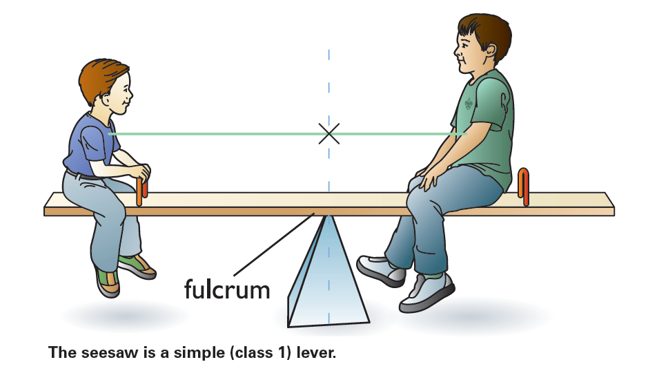
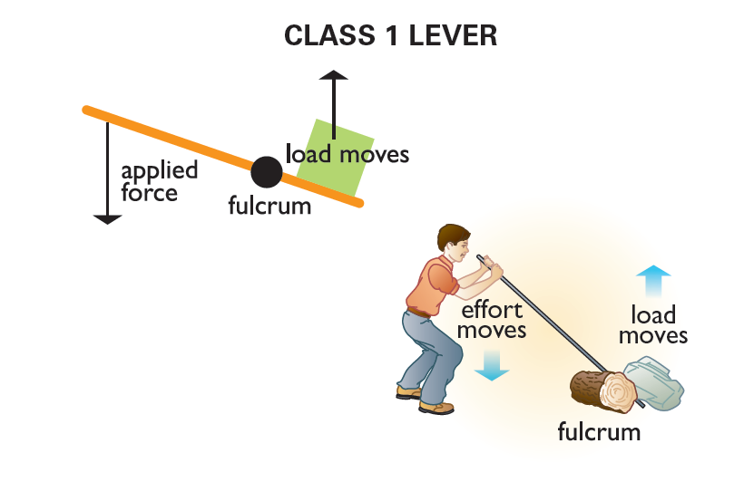
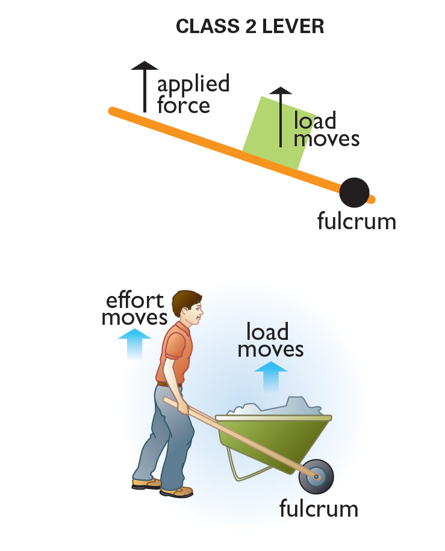
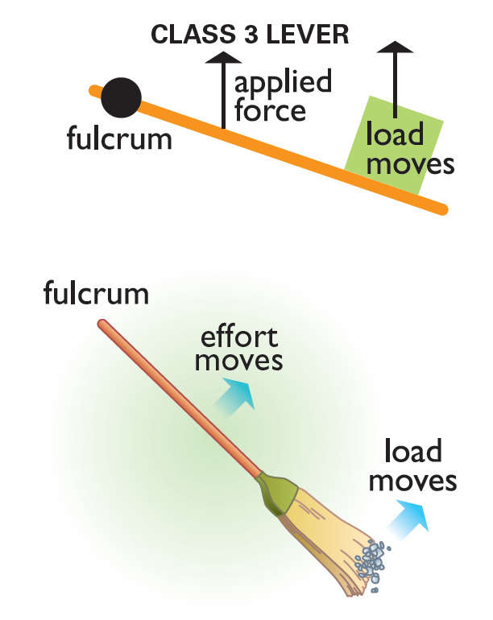

This module is designed to help you explore how engineering and simple machines called levers affect your life each day. Engineering is considered the application of scientific and mathematical principles to create the design, manufacture, and operation of structures, machines, processes, and systems. Engineering is very closely aligned with technology.

{{#requirements}}
1. Choose A or B or C and complete ALL the requirements.
    A. Watch an episode or episodes (about one hour total) of a show about anything related to motion or machines. Then do the following:
        (1) Make a list of at least two questions or ideas from what you watched.
        (2) Discuss two of the questions or ideas with your counselor.
        {{#nova-note}}Some examples include — but are not limited to — shows found on PBS (“NOVA”), Discovery Channel, Science Channel, National Geographic Channel, TED Talks (online videos), and the History Channel. You may choose to watch a live performance or movie at a planetarium or science museum instead of watching a media production. You may watch online productions with your counselor’s approval and under your parent’s supervision.{{/nova-note}}
    B. Read (about one hour total) about anything related to motion or machines. Then do the following:
        (1) Make a list of at least two questions or ideas from what you read.
        (2) Discuss two of the questions or ideas with your counselor.
        {{#nova-note}}Books on many topics may be found at your local library.  Examples of magazines include but are not limited to Odyssey,  KIDS DISCOVER, National Geographic Kids, Highlights, and OWL or Owlkids (https://www.owlkids.com/).{{/nova-note}}
    C. Do a combination of reading and watching (about one hour total) about anything related to motion or machines. Then do the following:
        (1) Make a list of at least two questions or ideas from what you read and watched.
        (2) Discuss two of the questions or ideas with your counselor.
2. Complete ONE adventure from the following list for your current rank or complete option A or B. (If you choose an Adventure, choose one you have not already earned.) Discuss with your counselor what kind of science, technology, engineering, and math was used in the adventure or option.
    * **Wolf Cub Scouts:** Motor Away, Paws of Skill
        {{#note type="counselor"}}**Motor Away:** Application of scientific principles to create a better boat or plane design{{/note}}
        {{#note type="counselor"}}**Paws of Skill:** Levers are used in many sports, including baseball, golf, and tennis.{{/note}}
    * **Bear Cub Scouts:** Baloo the Builder, A Bear Goes Fishing
        {{#note type="counselor"}}**Baloo the Builder:** Using a lever (crowbars, pliers, screwdrivers, hammer, etc.){{/note}}
        {{#note type="counselor"}}**A Bear Goes Fishing:** Using a lever (a fishing rod){{/note}}
    * **Webelos Scouts:** Adventures in Science, Engineer
        {{#note type="counselor"}}**Adventures in Science:** Rockets, motion on playground, and creating circuits are all part of engineering.{{/note}}
        {{#note type="counselor"}}**Engineer:** Entire adventure deals with engineering.{{/note}}
    **Option A:** With your parent’s permission, take an old or broken household or mechanical item, break it down into its component pieces, and identify the purpose of five parts. Suggested items include a keyboard, floppy disk, telephone, VCR, tape deck, bicycle, people counter, printer or similar item. Make sure to use appropriate safety precautions.
    **Option B:** Participate in two sports, either as an individual or part of a team, and identify the levers used in each sport.
3. Explore EACH of the following.
    A. Levers
        (1) Make a list or drawing of the three types of levers. (A lever is one kind of simple machine.)
        (2) Show:
            1. How each lever works
            2. How the lever in your design will move something
            3. The class of each lever
            4. Why we use levers
            {{#note type="counselor"}}{{/note}}
            {{#note type="counselor"}}A lever is a rigid bar that turns around a fulcrum, or fixed point. The force — a push or a pull that is applied to the lever — is called the effort. The farther the effort is from the fulcrum, the easier it is to use the lever. What the lever moves is called the load or the resistance. Levers can change the direction of motion, make it easier to move something, or cause something to move a greater distance. There are three classes, or types, of levers.{{/note}}
            {{#note type="counselor"}}Class 1 lever — The fulcrum is located between the effort and the load. The load always pushes down because of its weight. The force applied will push up on the load.{{/note}}
            {{#note type="counselor"}}In a class 1 lever, you push down. Even though you are pushing down because of its weight, the load will be lifted up. Also in a class 1 lever, you apply force in the direction opposite the direction you want the object to move. Depending on where the fulcrum is placed, a class 1 lever can make the load either move more easily or move a greater distance. Examples of class 1 levers include seesaws, crowbars, scissors, and pliers.{{/note}}
            {{#note type="counselor"}}{{/note}}
            {{#note type="counselor"}}Class 2 lever — The fulcrum is at one end, the effort is at the other end, and the load is in the middle. The effort and the load move in the same direction. In a class 2 lever, the load pushes down, but you lift up to lift up the load. A class 2 lever makes an object easier to move. Examples of class 2 levers include wheelbarrows, catapults, bottle openers, screwdrivers, nutcrackers, staplers, and wheelbarrows.{{/note}}
            {{#note type="counselor"}}{{/note}}
            {{#note type="counselor"}}Class 3 lever — The fulcrum is at one end, and the effort is applied between the fulcrum and the load. In a class 3 lever, you push in the direction you want the load to move. A class 3 lever makes an object harder to move but moves the object a much greater distance than the effort moves, such as a hammer driving a nail. Because the load end moves faster than the effort (it has to travel farther during the same amount of time), the load gains speed, such as swinging a baseball bat or golf club. Many sporting activities use class 3 levers, such as baseball bats, tennis rackets, canoe paddles, golf clubs, and fishing poles.  Other examples of class 3 levers include the human arm, brooms, shovels, tweezers, and staple removers.{{/note}}
            {{#note type="counselor"}}{{/note}}
            {{#note type="counselor"}}Bats, clubs, rockets, paddles, and fishing poles are class 3 levers.{{/note}}
    B. On your own, design, including a drawing, sketch, or model, ONE of the following:
        (1) A playground fixture that uses a lever
        (2) A game or sport that uses a lever
        (3) An invention that uses a lever
        Be sure to show how the lever in your design will move something.
    C. Discuss your findings with your counselor.
        {{#note type="counselor"}}Levers can be used to:{{/note}}
        {{#note type="counselor"}}• Make things easier to move — A small force applied over a large distance results in a large force moving a small distance (class 1 levers where the applied force is farther away from the fulcrum than the load, and class 2 levers).{{/note}}
        {{#note type="counselor"}}* Change the direction of the applied force (class 1 levers).{{/note}}
        {{#note type="counselor"}}* Increase the distance an object moves — A large force applied over a small distance moves the load a large distance. (This happens with class 3 levers and class 1 levers where the fulcrum is closer to the applied force than the load.){{/note}}
4. Do the following:
    A. Visit a place that uses levers, such as a playground, carpentry shop, construction site, restaurant kitchen, or any other location that uses levers.
        {{#note type="counselor"}}* Playground — Seesaws (class 1), swings (class 2), and sandbox shovels (class 3){{/note}}
        {{#note type="counselor"}}* Carpentry shop — hammers (class 3; the hammer’s claw is a class 1){{/note}}
        {{#note type="counselor"}}* Construction site — crowbar (class 1, pliers (class 1), backhoe (class 1), shovel (class 3){{/note}}
        {{#note type="counselor"}}* Restaurant kitchen — can opener (class 1), spoons and forks (class 3), bottle opener (class 2){{/note}}
    B. Discuss with your counselor the equipment or tools that use levers in the place you visited.  Visitations to places like carpentry shops, construction sites, restaurant kitchens, etc., will require advance planning by the counselor. The counselor should call ahead to make arrangements, and make plans to have appropriate supervision of all Scouts.
        {{#note type="counselor"}}Visitations to places like carpentry shops, construction sites, restaurant kitchens, etc., will require advance planning by the counselor. The counselor should call ahead to make arrangements, and make plans to have appropriate supervision of all Scouts.  The site will very likely have rules and instructions that must be followed. The counselor should help ensure that all the participants are aware of and follow those rules. This may include safety procedures and other instructions. The site will very likely have rules and instructions that must be followed. The counselor should help ensure that all the participants are aware of and follow those rules. This may include safety procedures and other instructions.{{/note}}
5. Discuss with your counselor how engineering and simple machines affect your everyday life.
{{#note type="counselor"}}**Helpful Link:** TechnologyStudent.com (http://www.technologystudent.com/forcmom/lever1.htm){{/note}}
{{/requirements}}
