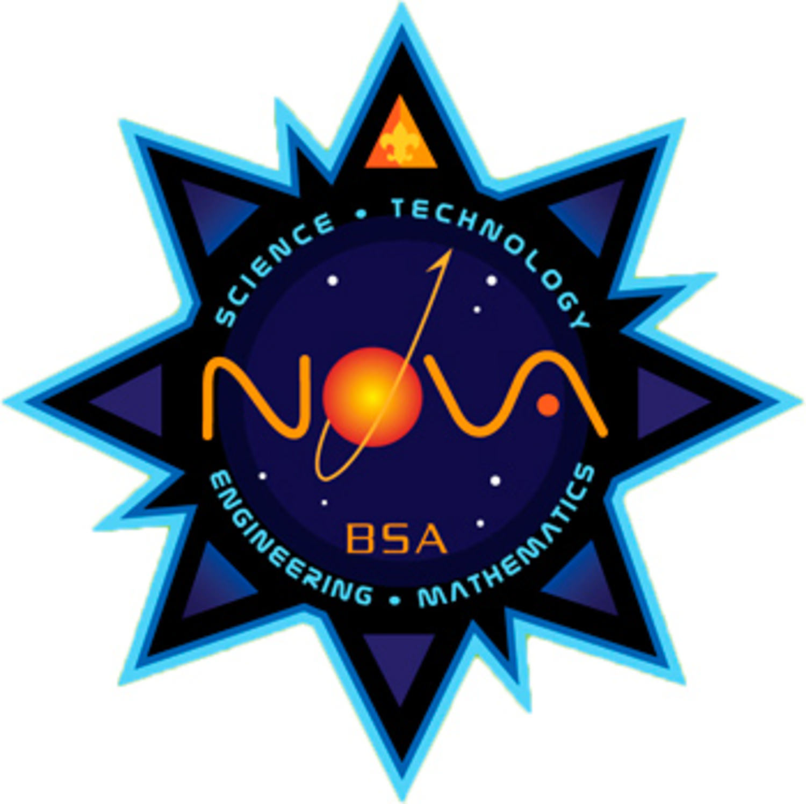
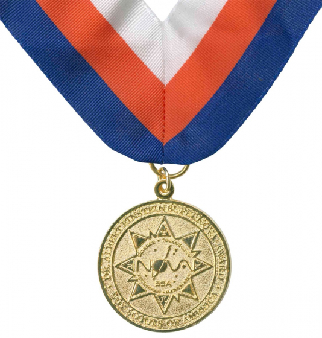

# Welcome to Scoutmaster Bucky's Nova Lab!

STEM (Science, Technology, Engineering, and Math) has been a part of Scouts since the earliest times. Youth were encouraged to observe the world around them, analyze problems, experiment, and come up with solutions and new information. This applies to topics ranging from programming (technology) to model design and building (engineering). It even helps us understand the typical "Scouting skills" such as campfires (the science of chemistry) and knots (mathematics and knot theory).

These four subject areas tie into our life every day.

* The food that you are eating has been tested for nutrient value and often balanced to ensure a healthy diet.
* Automobiles are fine tuned for maximizing performance while minimizing fuel costs and environmental damage.
* Video games have physics engines to make them more realistic with regard to objects, lighting, and the environment.
* Better farming techniques are researched in order to produce more yield, including in the cotton industry for your clothes.
* Even the paper you use has been researched and new formulas have been found in order to have it last longer or work better.

## Nova and Supernova Awards

Because of how prevalent and important these fields of research are, the Boy Scouts of America has created Nova and Supernova awards. The Cub Scout, Scouts BSA, Venturer, or Sea Scout can complete some of the requirements for rank advancement or typical progression. A little extra work will be rewarded with the Nova Award patch. Subsequent Nova Awards are rewarded with a device that's pinned to the patch.

Earning a Nova award, at a very high level, looks like this for the different programs:

* **[Cub Scouts](cub-scouts/):** 1 hour of study, 1 STEM-related adventure or equivalent, an exploration into a field, and discussions with a Nova counselor. Often drawings, charts, posters, or other visual aids are created. The Scout takes on a couple of experiments and reports on the findings.

* **[Scouts BSA](scouts-bsa/):** 3 hours of study, 1 STEM-related merit badge, additional research into a field, some actual work, and discussions with a Nova counselor. Visual aids are often produced in the form of models, charts, drawings, presentations, or reports. The additional work that is performed is sufficient to have a good sample of that field in order to gain further understanding.

* **[Venturing and Sea Scouts](venturing-and-sea-scouts/):** 3 hours of study, 1 [STEM-related exploration](venturing-and-sea-scouts-explorations/), additional research into a field, some actual work, and discussions with a Nova counselor. Visual aids are often produced in the form of models, charts, drawings, presentations, or reports. The additional work that is performed is sufficient to have a good sample of that field in order to gain further understanding.

After earning some Nova awards, the next step is to work on a [Supernova Award](supernova/). Bronze Supernova Awards are about the same amount of work as a Nova. These medals start with a bronze, then progress to silver and gold, depending on your program - [learn more about award progression](supernova/).

These medals are rarely given out and may be worn during formal events, such as at Blue and Gold ceremonies, Courts of Honor, and Bridges of Honor.

