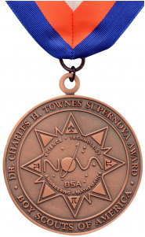

**Dr. Charles Townes Supernova Award** *For Webelos and Arrow of Light Scouts*

To earn the Dr. Charles Townes Supernova award, you must be a Webelos or Arrow of Light Scout who is active with a den. With your parent’s and unit leader’s help, you must select a council-approved mentor who is a registered Scouter. You may NOT choose your parent or your unit leader (unless the mentor is working with more than one youth).  Webelos Scouts and Arrow of Light Scouts can earn the same Nova Awards as Cub Scouts.

Although it is not a requirement, it is recommended that you earn at least two Nova awards for Cub Scouts before earning the Dr. Charles H. Townes Supernova Award.

This Supernova award can be earned by Webelos and Arrow of Light Scouts like you.

# Requirements

{{#requirements}}
1. Complete three of the following: Adventures in Science, Engineer, option A, or option B.
    **Option A:**  Do all of the following:
        (a) Construct one of the following from wood, and one from another material: Book rack, Shelf, Bulletin board, Tie rack, Letter holder, Notepad holder, Toolbox, Towel rack, Recipe holder, Lamp stand, Kitchen knife rack, Kitchen utensil rack, Napkin holder, Garden tool rack, Lid holder, Mailbox, Birdhouse, Desk nameplate, Letter, bill, and pencil holder, Bread box, Key rack, Measuring cup rack, Measuring spoon rack.
        (b) Keep an “insect zoo” with insects that you have collected. You might have crickets, ants, or grasshoppers. Study them for a while then release them. Share your experience with your den or your Mentor.
        (c) With adult supervision, show how to check the oil level and tire pressure on a car.
    **Option B:** Do all of the following:
        (a) Take a field trip to a geological site, geological laboratory, or rock show. Discuss what you learned at an upcoming den meeting or with your mentor.
        (b) Construct a simple working electrical circuit using a flashlight battery, a switch, and a light.
        (c) Do five activities within your home or school that require the use of mathematics. Explain to your den or your Mentor how you use math every day.
2. Complete three of the following: Build It, First Responder, Into the Wild, Into the Woods, option A or option B.
    **Option A:**  Do two of the following:
        (a) Go on a geocaching adventure with your den or family. Show how you used a GPS unit or a smartphone with a GPS application to locate a geocache.
        (b) Describe both the benefits and the harm wildfires can cause in a forest ecosystem. Tell how you can prevent wildfire.
        (c) Set up an aquarium or terrarium. Keep it for at least a month.
    **Option B:**  Do both of the following:
        (a) With adult supervision, build and launch a model rocket. Describe how Newton’s third law of motion explains how the rocket is propelled into the sky.
        (b) While on a campout or night hike, identify five constellations or satellites in the night sky.
3. Find interesting facts about Dr. Charles H. Townes using resources in your school or local library or on the Internet (with your parent’s or guardian’s permission and guidance). Then discuss what you learned with your mentor, including answers to the following questions: What very important award did Dr. Townes earn? What was Dr. Townes’ most famous invention?
4. Find out about five other famous scientists, technology innovators, engineers, or mathematicians approved by your mentor. Discuss what you learned with your mentor.
5. Speak with your teacher(s) at school (or your parents if you are home-schooled) OR one of your Cub Scout leaders about your interest in earning the Webelos Scout Supernova award. Ask them why they think math and science are important in your education. Discuss what you learn with your mentor.
6. Participate in a science project or experiment in your classroom or school. Discuss this activity with your mentor.
7. Do ONE of the following:
    a. Visit with someone who works in a STEM-related career. Discuss what you learned with your mentor.
    b. Learn about a career that depends on knowledge about science, technology, engineering, or mathematics. Discuss what you learned with your mentor.
8. Under the direct supervision of your mentor, do an experiment that shows how the scientific method (or scientific process) is used. Prepare a short report on the results of your experiment for your mentor.
9. Participate in a Nova- or other STEM-related activity in your Webelos Scout den or pack meeting that is conducted by a Boy Scout or Venturer who is working on his or her Supernova award. If this is not possible, participate in another Nova- or STEM-related activity in your den or pack meeting.
10. Submit an application for the Webelos Scout Supernova award PDF icon to the district STEM or advancement committee for approval.
{{/requirements}}
