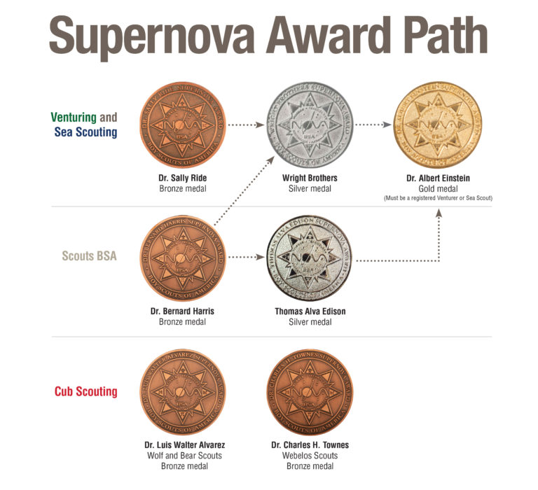

# Supernova Awards

These awards are ways to reward Scouts for learning more about Science, Technology, Engineering, and Math (STEM) subjects. The Supernova awards are earned as the next step after achieving Nova awards. There are different Nova awards for each program: [Cub Scouts](../cub-scouts/), [Scouts BSA](../scouts-bsa/), and [Venturing and Sea Scouts](../venturing-and-sea-scouts/).

### Cub Scout Supernova Awards

{{>supernova supernova="dr-luis-walter-alvarez"}}
{{>supernova supernova="dr-charles-h-townes"}}

### Scouts BSA Supernova Awards

{{>supernova supernova="dr-bernard-harris"}}
{{>supernova supernova="thomas-alva-edison"}}

### Venturing and Sea Scout Supernova Awards

{{>supernova supernova="dr-sally-ride"}}
{{>supernova supernova="wright-brothers"}}
{{>supernova supernova="dr-albert-einstein"}}

## Supernova Award Progression

* Cub Scouts
    * (Bronze) Bear and Wolf Cub Scouts can earn the {{#trim}}{{>supernova-link supernova="dr-luis-walter-alvarez" sa=true}}{{/trim}}.
    * (Bronze) Webelos and Arrow of Light Scouts have the {{#trim}}{{>supernova-link supernova="dr-charles-h-townes" sa=true}}{{/trim}}.
* Scouts BSA
    * (Bronze) Earn the {{#trim}}{{>supernova-link supernova="dr-bernard-harris" sa=true}}{{/trim}} first.
    * (Silver) The {{#trim}}{{>supernova-link supernova="thomas-alva-edison" sa=true}}{{/trim}} is able to be earned after the bronze.
* Venturers and Sea Scouts
    * (Bronze) Start with the bronze {{#trim}}{{>supernova-link supernova="dr-sally-ride" sa=true}}{{/trim}}.
    * (Silver) You may work on the {{#trim}}{{>supernova-link supernova="wright-brothers" sa=true}}{{/trim}} after earning the Scouts BSA or Venturing / Sea Scouts bronze.
    * (Gold) The {{#trim}}{{>supernova-link supernova="dr-albert-einstein" sa=true}}{{/trim}} can be worked on after the Scouts BSA or Venturing / Sea Scouts silver.

