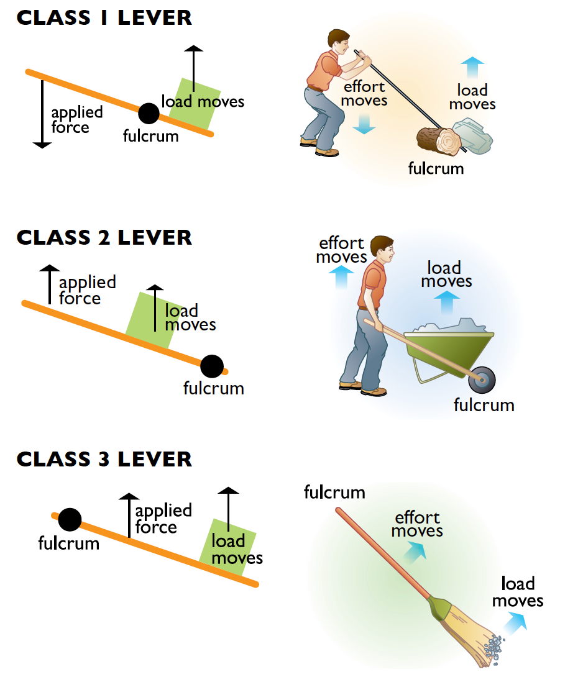
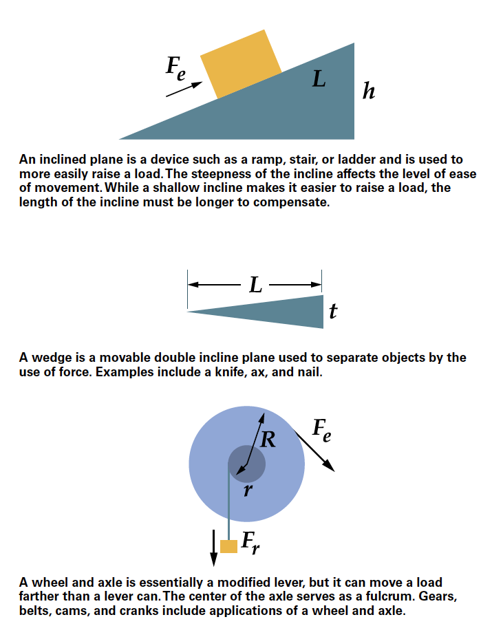
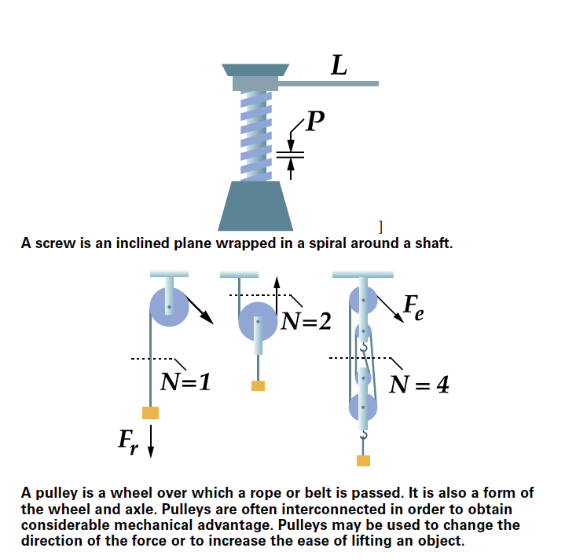
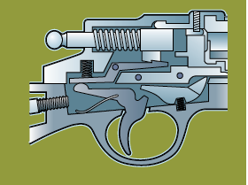

This module is designed to help Venturers and Sea Scouts explore how engineering affects their life each day.

{{#requirements}}
1. Choose A or B or C and complete ALL the requirements.
    A. Watch about three hours total of engineering-related shows or documentaries that involve motion or motion-inspired technology. Then do the following:
        (1) Make a list of at least two questions or ideas from each show.
        (2) Discuss two of the questions or ideas with your counselor.
        {{#note type="counselor"}}Some examples include—but are not limited to—shows found on PBS (“NOVA”), Discovery Channel, Science Channel, National Geographic Channel, TED Talks (online videos), and the History Channel. You may choose to watch a live performance or movie at a planetarium or science museum instead of watching a media production. You may watch online productions with your counselor’s approval and under your parent’s or guardian’s supervision. One example is the NOVA Lever an Obelisk page on ancient Egypt and the use of levers, available at http://www.pbs.org/wgbh/nova/egypt/raising/lever.html.{{/note}}
    B. Read (about three hours total) about motion or motion-inspired technology and then do the following:
        (1) Make a list of at least two questions or ideas from each article.
        (2) Discuss two of the questions or ideas with your counselor.
        {{#note type="counselor"}}Examples of magazines include—but are not limited to—Odyssey, Popular Mechanics, Popular Science, Science Illustrated, Discover, Air & Space, Popular Astronomy, Astronomy, Science News, Sky & Telescope, Natural History, Robot, Servo, Nuts and Volts, and Scientific American.{{/note}}
    C. Do a combination of reading and watching (about three hours total). Then do the following:
        (1) Make a list of at least two questions or ideas from each article or show.
        (2) Discuss two of the questions or ideas with your counselor.
2. Choose ONE STEM field of interest from the following list. Complete ALL the requirements for a Venturing STEM exploration in that field. See [STEM Explorations](../../explorations/) for the requirements. (If you have already completed a Venturing STEM exploration in one of these fields, please choose a different field for this award.)
    * Archery
    * Aviation
    * Composite Materials
        Composites can be found just about everywhere: in airplanes and sports cars, golf clubs and guitars, boats and baseball bats, bathtubs and circuit boards, and even bridges. Composites make bicycles and skis lighter, kayaks and fishing poles stronger, houses warmer, and helmets tougher. Venturers and Sea Scouts can choose one of these items for their discussion to answer requirement 3c.
    * Drafting
    * Electronics
    * Engineering
    * Inventing
    * Model Design and Building
    * Railroading
    * Rifle Shooting
    * Robotics
    * Shotgun Shooting
3. Do ALL of the following:
    A. Make a list or drawing of the six simple machines.
        Helpful links
        “Simple Machine Elements”: Connexions
        Website: http://cnx.org/content/m13594/latest
        “Resource Information for Teaching Simple Machines”: Illinois State University Department of Physics
        Website: http://www.phy.ilstu.edu/pte/489.01content/simple_machines/simple_machines.html
        {{#note type="counselor"}}A lever is a rigid bar that turns around a fulcrum or fixed point. The force - a push or a pull that is applied to the lever - is called the effort. The farther the effort is from the fulcrum, the easier it is to use the lever. What the lever moves is called the load or the resistance. Levers can change the direction of motion, make it easier to move something, or cause something to move a greater distance. There are three classes, or types, of levers. Class 1 lever - The fulcrum is located between the effort and the load. The direction the load moves is opposite the direction of the effort.  Depending on where the fulcrum is placed, a class 1 lever can either move the load more easily or move the load a greater distance. Examples of class 1 levers include seesaws, crowbars, scissors, and pliers.{{/note}}
        {{#note type="counselor"}}Class 2 lever - The fulcrum is at one end, the effort is at the other end, and the load is in the middle.  The effort and the load move in the same direction.{{/note}}
        {{#note type="counselor"}}A class 2 lever makes an object easier to move. Examples of class 2 levers include catapults, screwdrivers, nutcrackers, staplers, and wheelbarrows.{{/note}}
        {{#note type="counselor"}}Class 3 lever - The fulcrum is at one end, and the effort is applied between the fulcrum and the load.  The effort and the load move in the same direction. A class 3 lever makes an object harder to move but moves the object a much greater distance than the effort moves. Because the load end moves faster than the effort (it has to travel farther during the same amount of time), the load gains speed.  Many sporting activities use class 3 levers.{{/note}}
        {{#note type="counselor"}}Examples of class 3 levers include bats, rackets, paddles, clubs, fishing poles, and brooms.{{/note}}
        {{#note type="counselor"}}{{/note}}
        {{#note type="counselor"}}{{/note}}
        {{#note type="counselor"}}{{/note}}
    B. Be able to tell your counselor the name of each machine and how each machine works.
    C. Discuss the following with your counselor:
        (1) The simple machines that were involved with the motion in your chosen STEM exploration (Hint: Look at the moving parts of an engine to find simple machines.)
            {{#note type="counselor"}}Helpful Links{{/note}}
            {{#note type="counselor"}}“Six Simple Machines”: ConstructionKnowledge.net{{/note}}
            {{#note type="counselor"}}Website: https://www.constructionknowledge.net/general_technical_knowledge/general_tech_basic_six_simple_machines.php{{/note}}
            {{#note type="counselor"}}* Archery - The bow is a lever and the hand is the fulcrum. Crossbows use a pulley.{{/note}}
            {{#note type="counselor"}}* Aviation - Wheel and axle, levers, and pulleys. Propellers are a type of screw.{{/note}}
            {{#note type="counselor"}}* Composite Materials - Composites can be found just about everywhere: in airplanes, golf clubs, baseball bats, circuit boards, and even bridges. Composites make sporting equipment lighter and stronger, houses warmer, and helmets tougher. Pick a composite product and discuss the machines made of the components.{{/note}}
            {{#note type="counselor"}}* Drafting - Incline plane (triangle), wheel and axle, and lever.{{/note}}
            {{#note type="counselor"}}* Electronics - Varies. Lever used in soldering irons, switches, and circuit breakers (see http://electronics.howstuffworks.com/circuit-breaker2.htm).{{/note}}
            {{#note type="counselor"}}* Engineering - Engineering makes use of all the simple machines. See https://www.teachengineering.org/lessons/view/cub_simp_machines_lesson01#:~:text=Engineers%20use%20the%20concepts%20of%20simple%20machines%20to,improve%20society%20through%20making%20life%27s%20tasks%20much%20easier{{/note}}
            {{#note type="counselor"}}* Inventing - Inventors can use simple machines to help them construct theirprototypes; their inventions may incorporate simple machines.{{/note}}
            {{#note type="counselor"}}* Model Design and Building - Tools such as knives (wedge), handsaws (wedge), vises (screw and lever), files, hammers (lever), screwdrivers (lever), hand drills (screw, wheel and axle), drill bits (screw), and pliers (two levers working together).{{/note}}
            {{#note type="counselor"}}* Railroading - Levers, wheel and axle.{{/note}}
            {{#note type="counselor"}}* Rifle Shooting - The fulcrum (pivot point) in the trigger mechanism is between the effort (applied by the trigger finger) and where the pressure (the load or resistance) is applied to the spring.{{/note}}
                {{#note type="counselor"}}{{/note}}
            {{#note type="counselor"}}* Robotics - Robot designers and builders can use simple machines to help them build their robots. Robots may contain simple machines to help them function, similar to how the human body incorporates simple machines.{{/note}}
            {{#note type="counselor"}}* Shotgun Shooting - See Rifle Shooting.{{/note}}
        (2) The energy source causing the motion for the subject of your STEM exploration
        (3) What you learned about motion from doing the STEM exploration
            {{#note type="counselor"}}Wind, gasoline/fossil fuel, electric power, and human power all are sources of energy.{{/note}}
4. Choose A or B and complete ALL the requirements.
    A. Visit an amusement park. Then discuss the following with your counselor:
        (1) The simple machines present in at least two of the rides
        (2) The forces involved in the motion of any two rides
            {{#note type="counselor"}}A force is a push or a pull. Many rides use the force of gravity to cause changes in up and down motion. Rides that go in a circle use centripetal force.{{/note}}
    B. Visit a playground. Then discuss the following with your counselor:
        (1) The simple machines present in the playground equipment
        (2) The forces involved in the motion of any two playground fixtures
5. Do the following:
    A. On your own, design one of the following and include a drawing or sketch: an amusement park ride OR a playground fixture OR a method of transportation.
    B. Discuss with your counselor:
        (1) The simple machines present in your design
        (2) The energy source powering the motion of your creation
6. Discuss with your counselor how engineering affects your everyday life.
{{/requirements}}
