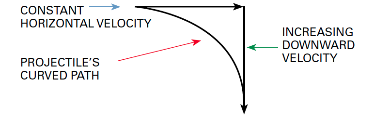

This module is designed to help you explore how science affects your life each day.

{{#requirements}}
1. Choose A or B or C and complete ALL the requirements.
    A. Watch about three hours total of science-related shows or documentaries that involve projectiles, aviation, weather, astronomy, or space technology. Then do the following:
        (1) Make a list of at least two questions or ideas from each show.
        (2) Discuss two of the questions or ideas with your counselor.
            Some examples include—but are not limited to—shows found on PBS (“NOVA”), Discovery Channel, Science Channel, National Geographic Channel, TED Talks (online videos), and the History Channel. The NASA website at www.nasa.gov has some short multimedia clips that involve projectiles, aviation, space, weather, astronomy, or aviation or space technology. You may choose to watch a live performance or movie at a planetarium or science museum instead of watching a media production. You may watch online productions with your counselor’s approval and under your parent’s supervision.
    B. Read (about three hours total) about projectiles, aviation, space, weather, astronomy, or aviation or space technology. Then do the following:
        (1) Make a list of at least two questions or ideas from each article.
        (2) Discuss two of the questions or ideas with your counselor.
            Examples of magazines include—but are not limited to—Odyssey, Popular Mechanics, Popular Science, Science Illustrated, Discover, Air & Space, Popular Astronomy, Astronomy, Science News, Sky & Telescope, Natural History, Robot, Servo, Nuts and Volts, and Scientific American.
    C. Do a combination of reading and watching (about three hours total). Then do the following:
        (1) Make a list of at least two questions or ideas from each article or show.
        (2) Discuss two of the questions or ideas with your counselor.
2. Choose ONE STEM field of interest from the following list. Complete ALL the requirements for a STEM exploration in that field. See [STEM Explorations](../../explorations/) for the requirements. (If you have already completed a Venturing STEM exploration in one of these fields, please choose a different field for this award.)
    * Archery
    * Astronomy
    * Athletics
    * Aviation
    * Rifle Shooting
    * Robotics
    * Shotgun Shooting
    * Space Exploration
    * Weather
3. Choose A or B and complete ALL the requirements.
    A. Simulations. Find and use a projectile simulation applet on the Internet (with your parent’s or guardian’s permission). Then design and complete a hands-on experiment to demonstrate projectile motion.
        (1) Keep a record of the angle, time, and distance.
        (2) Graph the results of your experiment. (Note: Using a high-speed camera or video camera may make the graphing easier, as will doing many repetitions using variable heights from which the projectile can be launched.)
            Helpful Links
            Be sure you have your parent’s or guardian’s permission before using the Internet. Some of these websites require the use of Java runtime environments. If your computer does not support this program, you may not be able to visit those sites.
            Projectile Motion Applets
            Website: http://galileoandeinstein.physics.virginia.edu/more_stuff/Applets/Projectile/projectile.html
            Fowler's Physics Applets
            Website: https://www.compadre.org/introphys/items/detail.cfm?ID=7823#:~:text=Fowler%27s%20Physics%20Applets%20This%20is%20a%20collection%20of,collection%20includes%20materials%20in%20mechanics%2C%20and%20modern%20physics.
            Java Applets on Physics
            Website: http://www.cco.caltech.edu/~phys1/java.html
        (3) Discuss with your counselor:
            (a) What a projectile is
                {{#note type="counselor"}}A projectile is:{{/note}}
                {{#note type="counselor"}}* An object that is fired, launched, or thrown, but which cannot propel itself{{/note}}
                {{#note type="counselor"}}* A self-propelled missile, like a rocket{{/note}}
            (b) What projectile motion is
            (c) The factors affecting the path of a projectile
                {{#note type="counselor"}}When an object is fired, launched, or thrown, it is given horizontal velocity. (Velocity is the same as speed, but it is speed in a given direction.) Once the object is launched, no additional force providing horizontal velocity is applied. Newton’s First Law of Motion states that a body at rest stays at rest and a body in motion stays in motion unless acted upon by an outside force. If gravity did not act on the projectile’s path, the object would continue to move in the direction in which it was launched. Once the object has been launched, the only force acting upon it is the force of gravity, which accelerates the object toward Earth.{{/note}}
                {{#note type="counselor"}}Projectile motion is the curved path taken by an object that is fired, launched, or thrown.{{/note}}
                {{#note type="counselor"}}Helpful Links{{/note}}
                {{#note type="counselor"}}“Free Fall and the Acceleration of Gravity”: The Physics Classroom{{/note}}
                {{#note type="counselor"}}Website: http://www.physicsclassroom.com/class/1dkin/u1l5b.cfm{{/note}}
                {{#note type="counselor"}}“Vectors—Fundamentals and Operations”: The Physics Classroom{{/note}}
                {{#note type="counselor"}}Website: http://www.physicsclassroom.com/class/vectors/u3l1e.cfm#trig{{/note}}
                {{#note type="counselor"}}“Projectile Motion”: The Physics Classroom{{/note}}
                {{#note type="counselor"}}Website: http://www.physicsclassroom.com/class/vectors/u3l2a.cfm{{/note}}
                {{#note type="counselor"}}Projectile motion is caused by the force of gravity giving vertical acceleration to an object that has horizontal velocity. (When an object is thrown straight up in the air, the force of gravity slows it down, it comes momentarily to a complete stop, then it accelerates downward.) An object that has been launched will continue to move in the direction it was thrown at the speed with which it was thrown, except for being slowed down by friction with the air (air resistance), but it will begin to accelerate toward Earth, moving faster toward Earth all the time. The combination of constant horizontal velocity and increasing downward velocity due to the acceleration of gravity is what gives a projectile its curved path.{{/note}}
                {{#note type="counselor"}}{{/note}}
                {{#note type="counselor"}}Forward velocity is the speed horizontal to Earth given to a projectile. If the projectile is thrown parallel to Earth, all of its original speed will be its forward velocity. If an object is thrown at an angle to Earth, the forward velocity is that portion of the velocity that is parallel to Earth.{{/note}}
                {{#note type="counselor"}}(Determining forward velocity can be done by separating the velocity into horizontal and vertical components—like on a triangle—using vector resolution.){{/note}}
                {{#note type="counselor"}}Forward velocity has a constant speed.{{/note}}
                {{#note type="counselor"}}Acceleration due to gravity slows down things that are moving upward and speeds up things that are moving downward. At most locations on Earth, the acceleration of gravity (9.80 m/s², or ~32.174 ft/s²) will cause an object to fall 9.8 meters per second faster each second. An object starting with no vertical motion will be falling toward Earth at the rate of 9.8 m/s at the end of one second and at the rate of 19.6 m/s at the end of two seconds. Acceleration due to gravity is constantly changing the vertical speed / velocity of an object.{{/note}}
            (d) The difference between forward velocity and acceleration due to gravity
    B. Discover. Explain to your counselor the difference between escape velocity (not the game), orbital velocity, and terminal velocity. Then answer TWO of the following questions. (With your parent’s or guardian’s permission, you may explore websites to find this information.)
        (1) Why are satellites usually launched toward the east, and what is a launch window?
            {{#note type="counselor"}}Escape velocity is the speed at which an object will be able to escape the gravity of Earth, the moon, or other body. An object must travel fast enough that it will not fall back to the surface. Escape velocity from Earth is 11.2 km/s, or 25038.72 mph. Escape velocity is proportional to the square root of the ratio between the mass of the larger body and the distance of the smaller object from the center of the larger body.{{/note}}
            {{#note type="counselor"}}Helpful Links{{/note}}
            {{#note type="counselor"}}“Escape Velocity”: Georgia State University{{/note}}
            {{#note type="counselor"}}Website: http://hyperphysics.phy-astr.gsu.edu/hbase/vesc.html{{/note}}
            {{#note type="counselor"}}Orbital velocity is achieved when an object’s horizontal velocity balances the acceleration of gravity at that location in space. An object that has orbital velocity (is in orbit) continues to fall toward Earth as it travels away from Earth, giving the object a circular path around Earth. The object continually falls around Earth due to the combination of horizontal velocity and acceleration due to gravity.{{/note}}
            {{#note type="counselor"}}Terminal velocity is the point at which the acceleration of gravity on an object matches the air resistance of the object. Terminal velocity is affected by the weight of the object and its orientation.  (The more surface area that is horizontal to Earth, the lower the terminal velocity. Skydivers who perform aerial displays use this fact. The first divers to jump lie flat to increase their air resistance.  Later divers streamline dive by holding their arms and legs tightly to their bodies and dive headfirst toward Earth in order to catch the earlier divers in the air.){{/note}}
            {{#note type="counselor"}}Note: If it were not for air resistance, all objects, regardless of mass, size, or any other factor, would fall at the SAME velocity.{{/note}}
            {{#note type="counselor"}}Watch astronauts David Scott and Jim Irwin do Galileo’s experiment on the moon.{{/note}}
            {{#note type="counselor"}}“NASA Lunar Feather Drop Home Page”: NASA{{/note}}
            {{#note type="counselor"}}Website: http://er.jsc.nasa.gov/seh/feather.html{{/note}}
            {{#note type="counselor"}}When satellites are launched to the east, Earth’s spin effectively adds to their velocity, making escape velocity easier to obtain and requiring less fuel. Not all spacecraft are launched toward the east; the launch direction depends also on the final orbit and purpose of the satellite. In order for a spacecraft to rendezvous with another spacecraft or other object in space, the orbits of both objects must be taken into consideration. A launch window describes a time period in which a mission must be launched for the objects’ orbits to overlap.{{/note}}
        (2) What is the average terminal velocity of a skydiver? (What is the fastest you would go if you were to jump out of an airplane?)
            {{#note type="counselor"}}Terminal velocity is when the acceleration due to gravity is matched by the air resistance (or resistance of whatever fluid the object is traveling through). When the acceleration of gravity is balanced by air resistance, the object continues to fall, but it does not increase its velocity.{{/note}}
            {{#note type="counselor"}}“A person has a terminal velocity of about 200 mph when balled up and about 125 mph with arms and feet fully extended to catch the wind.” Source: “Speed of a Skydiver (Terminal Velocity),” The Physics Factbook, website http://hypertextbook.com/facts/JianHuang.shtml.{{/note}}
        (3) How fast does a bullet, baseball, airplane, or rocket have to travel in order to escape Earth’s gravitational field? (What is Earth’s escape velocity?)
            {{#note type="counselor"}}Helpful Links{{/note}}
            {{#note type="counselor"}}“Orbital Mechanics”: Rocket & Space Technology{{/note}}
            {{#note type="counselor"}}Website: http://www.braeunig.us/space/orbmech.htm{{/note}}
            {{#note type="counselor"}}“What is a ‘launch window’?”: ESA{{/note}}
            {{#note type="counselor"}}Website: http://www.esa.int/esaSC/SEMO49YO4HD_index_0.html{{/note}}
            {{#note type="counselor"}}“Launch Windows: How NASA Decides When to Fly”: NRP{{/note}}
            {{#note type="counselor"}}Website: http://www.npr.org/templates/story/story.php?storyId=4749663{{/note}}
            {{#note type="counselor"}}“Terminal Velocity”: NASA{{/note}}
            {{#note type="counselor"}}Website: http://exploration.grc.nasa.gov/education/rocket/termvr.html{{/note}}
            {{#note type="counselor"}}Escape velocity from Earth is 11.2 km/s, or 25038.72 mph.{{/note}}
4. Choose A or B and complete ALL the requirements.
    A. Visit an observatory or a flight, aviation, or space museum.
        (1) During your visit, talk to a docent or person in charge about a science topic related to the site.
        (2) Discuss your visit with your counselor.
    B. Discover the latitude and longitude coordinates of your current position. Then do the following:
        (1) Find out what time a satellite will pass over your area. (A good resource to find the times for satellite passes is the Heavens Above website at http://www.heavens-above.com.)
        (2) Watch the satellite using binoculars. Record the time of your viewing, the weather conditions, how long the satellite was visible, and the path of the satellite. Then discuss your viewing with your counselor.
5. Choose A or B or C and complete ALL the requirements.
    A. Design and build a catapult that will launch a marshmallow a distance of 4 feet. Then do the following:
        (1) Keep track of your experimental data for every attempt. Include the angle of launch and the distance projected.
        (2) Make sure you apply the same force every time, perhaps by using a weight to launch the marshmallow.
        Discuss your design, data, and experiments—both successes and failures— with your counselor.
    B. Design a pitching machine that will lob a softball into the strike zone. Answer the following questions, then discuss your design, data, and experiments— both successes and failures—with your counselor.
        (1) At what angle and velocity will your machine need to eject the softball in order for the ball to travel through the strike zone from the pitcher’s mound?
        (2) How much force will you need to apply in order to power the ball to the plate?
        (3) If you were to use a power supply for your machine, what power source would you choose and why?
    C. Design and build a marble run or roller coaster that includes an empty space where the marble has to jump from one part of the chute to the other. Do the following, then discuss your design, data, and experiments—both successes and failures—with your counselor.
        (1) Keep track of your experimental data for every attempt. Include the vertical angle between the two parts of the chute and the horizontal distance between the two parts of the chute.
        (2) Experiment with different starting heights for the marble. How do the starting heights affect the velocity of the marble? How does the starting height affect the jump distance?
6. Discuss with your counselor how science affects your everyday life.
{{/requirements}}
