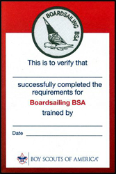

# Boardsailing BSA

{{>other-award-bucky}}

Swimsuit / swim trunks emblem - The Boardsailing BSA patch is NOT worn on the uniform or the sash; it is worn on the left side of the swimsuit / swim trunks

Boardsailing BSA has been developed to introduce basic boardsailing skills, equipment, and safety precautions; to encourage the development of skills that promote fitness and safe aquatic recreation; and to lay a foundation for more advanced and demanding boardsailing activities.  Any youth or adult who is registered with a troop, crew, or ship and completes the requirements is eligible for a patch and recognition card. The completed award application should be handled as directed by the council Training, Aquatics, or other committee.

All counselors must be trained in Safety Afloat and have council approval. Any
person recognized as a boardsailing instructor by US Windsurfing or US Sailing,
or someone with similar experience in boardsailing skills, safety, and
instruction, may serve as a counselor for this award.

Instruction must be conducted on a protected body of water in an area free from other traffic or large waves.  Initial water entry and practice should be on a gradual beach clear of hazards. A steady three-to-seven knot breeze is ideal for beginner practice. All participants should be close enough to supervisory personnel for efficient instruction and ready assistance.

All requirements must be completed as stated. Basic skills and safety precautions are presented in the BSA publication: [Aquatics Supervision: A Youth Leader’s Guide for Swimming and Boating Activities, No. 34346](aquatics-guide.pdf). Additional resources may be found online at www.uswindsurfing.org and www.ussailing.org.

## Boardsailing BSA Award

Upon successful completion, participants earn the Boardsailing BSA patch along with their achievement card.  Completion indiciates the individual has experieneced a valuable introduction to boardsailing.

## Boardsailing BSA Requirements

{{>show-requirements requirements=data.requirements}}

### Boardsailing BSA - Forms, Links, and Resources

[Aquatics Supervision - Leader's Guide](aquatics-guide.pdf) - the Boardsailing BSA award application is contained in the appendix.

Additional teaching and skill references may be found online at [www.uswindsurfing.org](https://uswindsurfing.org/) and [www.ussailing.org](https://www.ussailing.org/).
