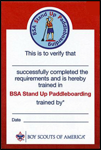
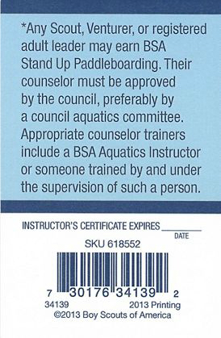

# BSA Stand Up Paddleboarding

{{#figure-container}}
{{>other-award-image}}

Swimsuit / swim trunks emblem

{{^}}

Any youth or adult who is registered with a troop, crew, or ship and completes the requirements is eligible for a patch and recognition card. The completed award application should be handled as directed by the council Training, Aquatics, or other committee. Instruction for the BSA SUP award is to be conducted under safe conditions on calm water. One to three hours in one or more sessions should suffice for instruction and practice.

Information and skills are discussed in Aquatics Supervision: A Leader’s Guide to Youth Swimming and Boating Activities, No. 34346, and the BSA SUP brochure at www.scouting.org. All counselors must be trained in Safety Afloat and have council approval. Any person with current training as a BSA Aquatics Instructor or as a SUP instructor by the American Canoe Association, or a person with similar experience in SUP skills, safety, and instruction may serve as a counselor.

*Swimsuit / swim trunks emblem - The BSA Stand Up Paddleboarding patch is NOT worn on the uniform or the sash; it is worn on the left side of the swimsuit / swim trunks*

{{/figure-container}}

## BSA Stand Up Paddleboarding Award

Upon successful completion, participants earn the BSA Stand Up Paddleboarding patch along with their achievement card.  Completion indicates the individual has experienced a valuable introduction to stand up paddleboarding.

{{#figure align="left"}}

{{/figure}}
{{#figure align="right"}}

{{/figure}}

## BSA Stand Up PaddleboardingRequirements

{{#figure-container position="top"}}
{{>other-award-bucky}}
{{^}}
{{>show-requirements requirements=data.requirements}}
{{/figure-container}}

### BSA Stand Up Paddleboarding - Forms, Links, and Resources

[Aquatics Supervision - Leader's Guide](../aquatics-guide.pdf) - the BSA Stand Up Paddleboarding award application is contained in the appendix.
