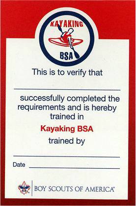
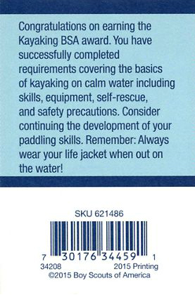

# Kayaking BSA

{{#figure-container}}
{{>other-award-image}}

Swimsuit / swim trunks emblem

{{^}}

Any youth or adult who is registered with a troop, crew, or ship and completes the requirements is eligible for a patch and recognition card, available from the local council service center. The completed award application should be handled as directed by the council Training, Aquatics, or other committee. Instruction for Kayaking BSA is to be conducted under safe conditions on calm water. Two to four hours in one or more sessions should suffice for instruction and practice. Paddle lengths and life jacket sizes should be adequate to fit all participants. Feathered blades are preferred, but blades at the same angle are allowed. Information and skills are discussed in [Aquatics Supervision: A Leader’s Guide to Youth Swimming and Boating Activities, No. 34346](../aquatics-guide.pdf), and the Kayaking merit badge pamphlet. All counselors must be trained in Safety Afloat. Any person with current training as a BSA Aquatics Instructor, a BSA Aquatics Supervision: Paddle Craft Safety kayak instructor or as a kayak instructor by the American Canoe Association may serve as a counselor for this award with the approval of the local council. A person with similar experience in kayaking skills, safety, and instruction may also serve as a counselor with council approval.  Kayaking BSA is intended to provide Scouts and their leaders with an introductory experience to kayaking on lakes, ponds, slow- moving water, or calm ocean areas. Additional preparation is needed before a unit does extended kayak touring or takes trips on class I or above white water.

*Swimsuit / swim trunks emblem - The Kayaking BSA patch is NOT worn on the uniform or the sash; it is worn on the left side of the swimsuit / swim trunks*

{{/figure-container}}

## Kayaking BSA Award

Upon successful completion, participants earn the Kayaking BSA patch along with their achievement card.  Completion indicates the individual has experienced a valuable introduction to kayaking.

{{#figure align="left"}}

{{/figure}}
{{#figure align="right"}}

{{/figure}}

## Kayaking BSA Requirements

{{#figure-container position="top"}}
{{>other-award-bucky}}
{{^}}
{{>show-requirements requirements=data.requirements}}
{{/figure-container}}

### Kayaking BSA - Forms, Links, and Resources

[Aquatics Supervision - Leader's Guide](../aquatics-guide.pdf) - the Kayaking BSA award application is contained in the appendix.
