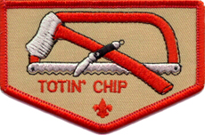
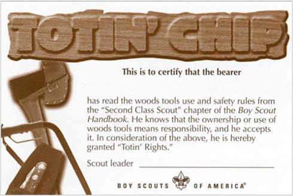
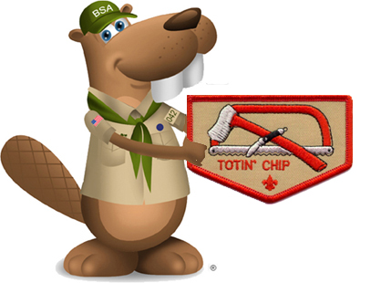

    

The Totin' Chip is awarded to Scouts that lean and demonstrate the proper ability to safely handle and use bladed tools.

The privileges this awards grants are able to be taken away if the Scout fails in their responsibility.

When earned, the Scout may receive the patch, the card, or both.

    

# Requirements

    

1. Read and understand woods tools use and safety rules from the Scouts BSA handbooks.
2. Demonstrate proper handling, care, and use of the pocketknife, ax, and saw.
3. Use knife, ax, and saw as tools, not playthings.
4. Respect all safety rules to protect others.
5. Respect property. Cut living and dead trees only with permission and good reason.
6. Subscribe to the Outdoor Code.
