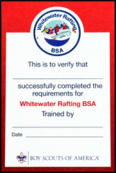
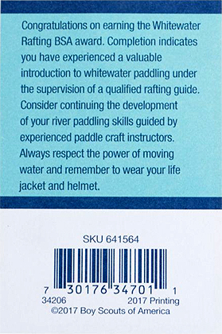

# Whitewater Rafting BSA

{{#figure-container}}
{{>other-award-image}}

Swimsuit / swim trunks emblem

{{^}}

This award is available to BSA youth and adults who are members of Boy Scout, Venturing, or Sea Scout units. Any adult leader, approved by the council, who is trained in Safety Afloat and can personally verify that all instruction and skill completions were directly supervised by a professionally trained or licensed rafting guide may serve as a counselor for this award. Such guides may be employed by council high- adventure programs or commercial outfitters. Guidance for selecting a reputable rafting service is provided in the BSA publication *Aquatics Supervision*, No. 34346.

*Swimsuit / swim trunks emblem - The Whitewater Rafting BSA patch is NOT worn on the uniform or the sash; it is worn on the left side of the swimsuit / swim trunks*

{{/figure-container}}

## Whitewater Rafting BSA Award

Upon successful completion, participants earn the Whitewater Rafting BSA patch along with their achievement card.  Completion indicates the individual has experienced a valuable introduction to whitewater rafting.

{{#figure align="left"}}

{{/figure}}
{{#figure align="right"}}

{{/figure}}

## Whitewater Rafting BSA Requirements

{{#figure-container position="top"}}
{{>other-award-bucky}}
{{^}}
{{>show-requirements requirements=data.requirements}}
{{/figure-container}}

### Whitewater Rafting BSA - Forms, Links, and Resources

[Aquatics Supervision - Leader's Guide](../aquatics-guide.pdf) - the Whitewater Rafting BSA award application is contained in the appendix.
