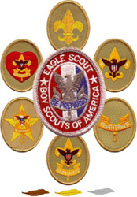

{{#figure-container}}

{{^}}

The rank requirements shown here are are official as of {{>last-updated section="scout-ranks" key="scout"}}.  If a Scout has started work toward a rank before this date using requirements that were current before January 1, 2020, except as noted, they may complete that rank using the old requirements.  Any progress toward a rank that is begun after January 1, 2020, must use the requirements as they are shown on the respective rank pages here.

Following are the ranks of Scouting.  Click on the respective rank or rank insignia for the requirements a Scouts BSA member must achieve to attain the respective rank.  While it is recommended and encouraged that Scouts complete their Scout rank exclusively, the requirements for Scout, Tenderfoot, Second Class, and First Class ranks may be worked on simultaneously; however these ranks must be earned in sequence.
{{/figure-container}}

## List of Scout Ranks

{{#badge-list}}
{{#each scoutRanks}}
{{#if rank}}
{{>scout-rank rank=@key}}
{{/if}}
{{/each}}
{{/badge-list}}

## Additional Awards and Information

{{#badge-list}}
{{#each scoutRanks}}
{{#unless rank}}
{{>scout-rank rank=@key}}
{{/unless}}
{{/each}}
{{/badge-list}}
